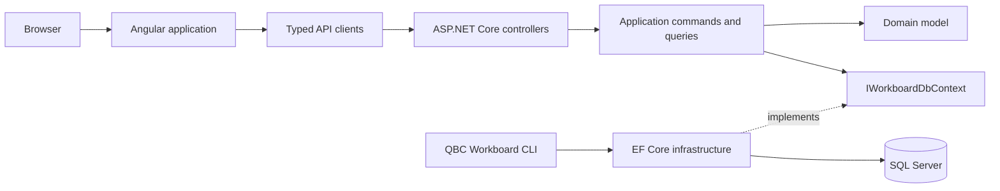

# QBC Workboard

[](https://github.com/QuinntyneBrown/quinntyne-brown-consulting/actions/workflows/ci.yml)
[](https://github.com/QuinntyneBrown/quinntyne-brown-consulting/actions/workflows/deploy-design-system.yml)
[](LICENSE)

QBC Workboard is a responsive Scrum workspace for planning and delivering
software, product, and AI consulting work. It connects initiatives, epics,
stories, tasks, assistants, backlog grooming, sprint planning, and active-sprint
execution in one persistent application.

> [!IMPORTANT]
> The deployed QBC Workboard is reachable publicly and is protected by a single
> shared passcode, not by user accounts. Everyone who knows the passcode shares
> one workspace with full read and write access, and no change is attributable to
> a person. Treat the passcode as a gate that keeps a public deployment private,
> not as authentication, and do not store confidential, personal, or client data
> in the workspace.

The project is under active development and does not yet publish tagged
releases. Requirements and data migrations may change before the first release.

## Features

- Navigate among the sprint board, backlog, initiative hierarchy, and assistant
  directory without a full-page reload.
- Manage initiatives, epics, stories, checklist tasks, and assistant assignments.
- Write each initiative's outcome brief as markdown, with a formatting toolbar,
  insertable building blocks, a live preview, and a heading outline.
- Groom and estimate stories before assigning them to a 14-day sprint.
- Move active work through To do, In progress, and Done with pointer, keyboard,
  and touch-friendly controls.
- Persist workspace state in SQL Server and protect hierarchy, assignment, and
  completed-sprint history.
- Publish the Angular application and ASP.NET Core API as one deployable output.
- Explore a standalone design-system catalog with reusable components, dialogs,
  and responsive product patterns.
- Keep the public deployment private behind a shared passcode that issues a
  seven-day session credential.
- Report the deployed build in the workspace, so the version and commit being
  served are readable from the sidebar and from the passcode screen.

## Architecture

QBC Workboard uses a browser application, controller-based API, Clean
Architecture backend, and SQL Server persistence.



| Area | Responsibility |
| --- | --- |
| `backend/src/Qbc.Workboard.Domain` | Entities, lifecycle rules, and enumerations |
| `backend/src/Qbc.Workboard.Application` | MediatR commands, queries, handlers, validation, and persistence contracts |
| `backend/src/Qbc.Workboard.Infrastructure` | EF Core mappings, SQL Server migrations, and database initialization |
| `backend/src/Qbc.Workboard.Api` | HTTP controllers, Problem Details, dependency injection, and production frontend hosting |
| `backend/src/Qbc.Workboard.Cli` | Installable .NET tool for database initialization and reset |
| `frontend/projects/qbc-workboard` | Routes, feature pages, orchestration, and Signal state |
| `frontend/projects/api` | Typed models, service interfaces, injection tokens, and HTTP clients |
| `frontend/projects/components` | Versioned Angular UI system aligned with the standalone component catalog |
| `design-system` | Standalone native Web Component catalog and contract tests |
| `docs` | Requirements, detailed designs, acceptance evidence, and prototypes |

The [detailed designs](docs/detailed-designs/) describe each vertical feature.
The [implementation alignment record](docs/implementation-design-alignment.md)
tracks known differences between those designs and the current source.

## Prerequisites

The default local workflow targets Windows because the application and tests use
the local `SQLEXPRESS` instance with Windows authentication.

- [Git](https://git-scm.com/)
- [PowerShell 7](https://learn.microsoft.com/powershell/scripting/install/installing-powershell)
- [.NET 10 SDK](https://dotnet.microsoft.com/download/dotnet/10.0)
- [Node.js 22](https://nodejs.org/) with npm
- [SQL Server Express](https://www.microsoft.com/sql-server/sql-server-downloads)

An accessible SQL Server instance may replace local SQL Server Express by
overriding `ConnectionStrings__Workboard`. Backend integration tests use
`Server=.\SQLEXPRESS` by default and accept an instance-level connection string
through `QBC_TEST_SQLSERVER_CONNECTION_STRING`; every test host assigns its own
unique database name.

## Quick start

Clone the repository and restore the locked dependencies:

```powershell
git clone https://github.com/QuinntyneBrown/quinntyne-brown-consulting.git
Set-Location quinntyne-brown-consulting

dotnet restore backend/Qbc.Workboard.slnx
Set-Location frontend
npm ci
Set-Location ..
```

Initialize the database with representative development data:

```powershell
dotnet run --project backend/src/Qbc.Workboard.Cli/Qbc.Workboard.Cli.csproj -- database initialize --seed
```

Start the API and Angular development server:

```powershell
pwsh ./eng/Start-Workboard.ps1
```

The launcher waits for both servers, opens the application, writes logs under
`eng/logs`, and stops its child processes on exit.

| Service | URL |
| --- | --- |
| Web application | `http://localhost:4200` |
| API | `http://localhost:5050/api/workspace?route=board` |
| OpenAPI document | `http://localhost:5050/openapi/v1.json` |
| Deployed build | `http://localhost:5050/api/version` |

### Run the servers manually

Start the API from the repository root:

```powershell
dotnet run --project backend/src/Qbc.Workboard.Api/Qbc.Workboard.Api.csproj --urls http://localhost:5050
```

Start Angular in a second terminal:

```powershell
Set-Location frontend
npm start
```

## Configuration

ASP.NET Core and the CLI read `appsettings.json`, environment variables, and the
standard .NET configuration providers.

| Setting | Default | Purpose |
| --- | --- | --- |
| `ConnectionStrings__Workboard` | `Server=.\SQLEXPRESS;Database=QbcWorkboard;...` | Selects the SQL Server database |
| `ConnectionStrings__WorkboardLocal` | Falls back to `ConnectionStrings__Workboard` | Overrides the CLI's `local` target |
| `ConnectionStrings__WorkboardAzure` | Passwordless Workboard Azure SQL connection in the packaged CLI | Selects the CLI's `azure` target |
| `SeedDevelopmentData` | `false` | Adds representative records when the database is empty |
| `DatabaseReset__RequireForce` | `true` | Requires `--force` before the CLI deletes a database |
| `AllowedOrigins__0` | unset | Adds an allowed CORS origin when the frontend uses a separate host |
| `Access__InitialPasscode` | `2846` | Passcode written when the workspace access record is first created |
| `Access__TokenLifetimeDays` | `7` | Lifetime of the session credential issued at unlock |

EF Core applies pending migrations when the API or initialization command
starts. Production environments should provide their connection string through
environment-specific configuration or a secret store, not a committed file.

## Workspace passcode

One shared passcode opens the whole workspace. Entering it returns a signed
session credential that authorizes every API request until it expires. This is a
gate, not authentication: it establishes no individual identity and no change is
attributable to a person.

Database initialization and reset create a single `WorkspaceAccess` row holding a
PBKDF2 hash of the passcode and a randomly generated signing key. Neither value
is committed to source control or supplied as a deployment setting, so no
application setting has to be configured to deploy the gate.

`Access__InitialPasscode` is read only when that row is created. Change the
passcode afterwards by deleting the row and restarting, which regenerates both
the passcode and the signing key and invalidates every credential already issued:

```powershell
sqlcmd -S '.\SQLEXPRESS' -d QbcWorkboard -E -Q 'DELETE FROM WorkspaceAccess'
```

Repeated attempts from one address are limited to ten in fifteen minutes and then
answered with HTTP 429. A four-digit passcode is only ten thousand combinations,
so that throttle, rather than the passcode itself, is what makes guessing
impractical.

## Initiative outcome briefs

Every initiative carries an outcome brief: its description, written and read as
markdown. **Edit brief** on an initiative opens it at
`/initiatives/{initiativeId}/brief`, which is an ordinary deep link and can be
shared or reloaded.

| Route | Purpose |
| --- | --- |
| `/board` | The active sprint board |
| `/backlog` | The searchable, filterable backlog |
| `/initiatives` | The initiative and epic hierarchy |
| `/initiatives/{initiativeId}/brief` | The initiative's markdown outcome brief |
| `/assistants` | The assistant directory |
| `/unlock` | The shared passcode screen |

The brief supports headings, emphasis, links, inline and fenced code, bulleted,
numbered and task lists with nesting, blockquotes, tables, and dividers. Write,
split, and preview views show the markdown source, both panes, or the rendered
brief alone. The outline lists the brief's headings and moves the editor to any
of them, and the status bar reports the word and character count.

A brief is required and is limited to 100,000 characters. Saving updates the
initiative, so a renamed initiative is renamed everywhere it appears. Leaving the
page with unsaved markdown asks whether to keep editing, discard the changes, or
save and continue; nothing about the brief is written to browser storage.

The markdown source is carried by a bundled code editor that is loaded only when
the brief route is opened. If it cannot be loaded, the brief falls back to a plain
markdown field with the same toolbar, preview, and outline.

## Database maintenance CLI

The CLI runs through the same infrastructure and migrations as the API. The
`local` target is the default, so existing commands retain their behaviour.

```powershell
# Preserve records and apply pending migrations
dotnet run --project backend/src/Qbc.Workboard.Cli/Qbc.Workboard.Cli.csproj -- database initialize

# Apply migrations and seed an empty database
dotnet run --project backend/src/Qbc.Workboard.Cli/Qbc.Workboard.Cli.csproj -- database initialize --seed

# Delete all records and recreate the database
dotnet run --project backend/src/Qbc.Workboard.Cli/Qbc.Workboard.Cli.csproj -- database reset --force

# Use the deployed Azure database after signing in with Azure CLI
az login --tenant c68758f6-70fb-41fe-8fb3-b3e35624a2a3
dotnet run --project backend/src/Qbc.Workboard.Cli/Qbc.Workboard.Cli.csproj -- database initialize --target azure
```

The Azure connection is passwordless and uses the current Azure CLI, Visual
Studio, or managed identity credential. The operator's current public IP must
be present in the Azure SQL firewall. Override either target with
`ConnectionStrings__WorkboardLocal` or `ConnectionStrings__WorkboardAzure`.

> [!CAUTION]
> A local reset requires `--force` and recreates the local database. An Azure
> reset preserves the Azure SQL resource but permanently removes its schema and
> data; it requires both `--force` and the exact database confirmation:
> `database reset --target azure --force --confirm-database QbcWorkboard`.

Package and install the CLI as a global .NET tool when repeated use is needed:

```powershell
dotnet pack backend/src/Qbc.Workboard.Cli/Qbc.Workboard.Cli.csproj --configuration Release --output artifacts/packages
dotnet tool install --global Qbc.Workboard.Cli --add-source artifacts/packages
qbc-workboard --help
```

## Build and test

Run the same principal checks used by CI:

```powershell
# Backend integration tests
dotnet test backend/Qbc.Workboard.slnx --configuration Release

# Angular libraries and application
Set-Location frontend
npm ci
npm run format:check
npm run build
npm run validate:components
npm run test:components

# Browser acceptance tests
npx playwright install
npm run typecheck:e2e
npm run test:e2e

# Standalone design system
Set-Location ../design-system
npm ci
npx playwright install chromium
npm test
```

The backend tests create uniquely named SQL Server databases and delete them on
disposal. Set `QBC_TEST_SQLSERVER_CONNECTION_STRING` to run them against a SQL
Server instance other than local `SQLEXPRESS`. The Playwright suite starts only
the built Angular application and uses a fresh, stateful API mock for each test,
running against Chromium. No backend process or test database is required by the
browser suite.

See [CONTRIBUTING.md](CONTRIBUTING.md) for the red-green-refactor workflow,
coding conventions, and pull-request checklist.

## Publish

Publishing the API installs locked frontend dependencies, builds all Angular
projects, and copies the browser bundle into the ASP.NET Core output:

```powershell
dotnet publish backend/src/Qbc.Workboard.Api/Qbc.Workboard.Api.csproj --configuration Release --output artifacts/publish
dotnet artifacts/publish/Qbc.Workboard.Api.dll --urls http://localhost:5050
```

The published API serves the Angular application and handles client-side route
fallback. A deployment should provide a production SQL Server connection string
and terminate TLS before exposing the application.

On pushes to `main`, CI deploys the verified combined artifact to the free-tier
Azure environment after both application and design-system jobs pass. See the
[Azure deployment plan](docs/azure-deployment-plan.md) for resource names,
identity configuration, cost controls, and operational limits.

### Deployed build identification

The two artifacts own their versions independently. `backend/Directory.Build.props`
carries the backend version, while `frontend/package.json` carries the frontend
version. The backend stamps its values as assembly metadata and the Angular
build embeds its values as compile-time constants. CI supplies the same source
revision to both builds so each artifact names the exact commit that produced it;
an ordinary local build uses the checkout's `HEAD` when one is available.

`GET /api/version` reports the backend identity as `{ "version", "commit" }`
and needs no passcode. The workspace shows separate `Backend` and `Frontend`
lines in the sidebar footer and on the passcode screen, so both deployed artifacts
can be confirmed from a browser and the backend can be queried from a shell:

```powershell
curl https://<workboard-host>/api/version
```

A build made where no revision is available reports no commit, and its line shows
only the version. If the API cannot be reached, the frontend identity remains
visible and the backend line is omitted without blocking the workspace.

## Design system

The standalone catalog documents 35 native components, seven dialog families,
and five responsive product patterns. The Angular application uses the matching
35-component surface from `@qbc/components`; a manifest gate keeps both
inventories aligned without coupling their runtimes.

Browse the live catalog on GitHub Pages:
<https://quinntynebrown.github.io/quinntyne-brown-consulting/>.

To run it locally instead:

```powershell
Set-Location design-system
npm ci
npm start
```

Open `http://127.0.0.1:5175/`. See the
[design-system guide](design-system/README.md) for its architecture, contract
gate, browser tests, and GitHub Pages deployment.

## Documentation

| Document | Purpose |
| --- | --- |
| [Documentation index](docs/README.md) | Entry point for product and engineering documentation |
| [L1 requirements](docs/specs/L1.md) | Product goals, architecture constraints, and scope boundaries |
| [L2 requirements](docs/specs/L2.md) | Detailed requirements and Given/When/Then acceptance criteria |
| [Detailed designs](docs/detailed-designs/) | Per-feature architecture and behavior diagrams |
| [Acceptance evidence](docs/acceptance-evidence.md) | Recorded ATDD red and green boundaries |
| [Implementation alignment](docs/implementation-design-alignment.md) | Known differences and the plan to align code and designs |
| [Contributing](CONTRIBUTING.md) | Development workflow and pull-request expectations |
| [Security](SECURITY.md) | Supported versions and private vulnerability reporting |
| [Support](SUPPORT.md) | Help channels and support boundaries |
| [Governance](GOVERNANCE.md) | Maintainer roles and decision process |
| [Code of Conduct](CODE_OF_CONDUCT.md) | Community participation standards |
| [Changelog](CHANGELOG.md) | User-visible changes by release |

## Contributing

Issues and pull requests are welcome. Read [CONTRIBUTING.md](CONTRIBUTING.md)
before starting a substantial change. Participation in this repository follows
the [Code of Conduct](CODE_OF_CONDUCT.md).

## Security and support

Do not report vulnerabilities in a public issue. Follow the private process in
[SECURITY.md](SECURITY.md). Use [SUPPORT.md](SUPPORT.md) for product questions,
bug reports, and feature requests.

## License

QBC Workboard is licensed under the [MIT License](LICENSE).
