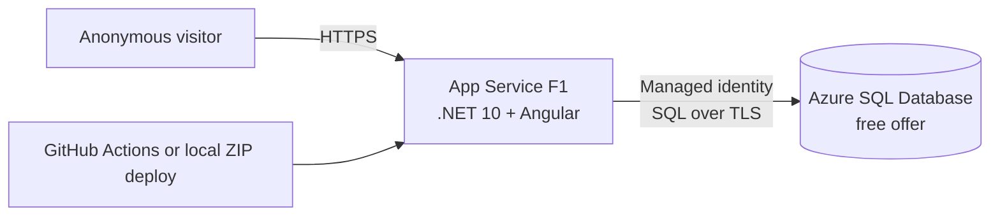

# Cheapest Azure deployment plan

## Decision

Deploy QBC Workboard as one code-only .NET 10 application on an Azure App
Service Free (`F1`) Linux plan, backed by one Azure SQL Database created with
the free database offer. Use the included `azurewebsites.net` hostname, allow
shared-passcode application access, and use a system-assigned managed identity for
database access.

The target Azure charge is **USD $0 per month and $0 per year**, provided all
eligibility and usage assumptions below remain true. The price is the public
pay-as-you-go list price checked on September 3, 2026; taxes, developer labour,
and any existing organization licences are outside the estimate.

This is the cheapest useful deployment because $0 is the minimum possible
Azure bill and the existing application already publishes the Angular frontend
inside the ASP.NET Core output. A container registry, container build, static
site, separate API, VM, and paid network resources are unnecessary.

> [!IMPORTANT]
> This plan is for a personal demo, proof of concept, or lightly used internal
> workspace where cold starts and outages are acceptable. Microsoft does not
> support the App Service Free tier for production workloads, and neither free
> service has an SLA. Re-cost the system before using it for client production
> data or a business-critical workflow.

## Target architecture



One App Service instance serves both the browser assets and `/api` routes. This
matches the current publish design and avoids cross-origin configuration. The
current local publish output is about 24.2 MiB, well below the F1 plan's 1 GB
storage limit.

## Cost estimate

| Item | Configuration and allowance | Monthly | Annual |
| --- | --- | ---: | ---: |
| App Service plan | Linux `F1`; shared compute, 60 CPU minutes/day, 1 GB RAM, 1 GB storage | $0.00 | $0.00 |
| Web app | One code-only .NET 10 app in the F1 plan | $0.00 | $0.00 |
| Azure SQL Database | Free offer; 100,000 vCore-seconds, 32 GB data, and 32 GB backup storage/month | $0.00 | $0.00 |
| Identity | System-assigned managed identity and GitHub deployment OIDC | $0.00 incremental | $0.00 incremental |
| Hostname and TLS | Default `*.azurewebsites.net` hostname and platform certificate | $0.00 | $0.00 |
| **Estimated Azure total** | While every free-tier guard and limit is retained | **$0.00** | **$0.00** |

The [App Service Linux price](https://azure.microsoft.com/en-us/pricing/details/app-service/linux/)
lists F1 at $0 with 60 CPU minutes per day, 1 GB RAM, and 1 GB storage. The
[App Service limits](https://learn.microsoft.com/en-us/azure/azure-resource-manager/management/azure-subscription-service-limits#azure-app-service-limits)
also cap F1 at three CPU minutes per five minutes and 165 MB of bandwidth per
day. Crossing a Free-plan CPU or bandwidth quota stops the app until the quota
resets; it does not scale and start billing automatically.

The [Azure SQL free offer](https://learn.microsoft.com/en-us/azure/azure-sql/database/free-offer?view=azuresql)
provides the database allowance for the lifetime of the subscription, for up to
10 eligible databases per subscription. Configure **Auto-pause the database
until next month** as the free-limit behaviour. With that guard, reaching the
compute or storage allowance makes the database unavailable until the next
calendar month instead of creating a charge. The offer includes locally
redundant backups and seven-day point-in-time-restore retention, but it has no
SLA and cannot be a failover-group member.

### What the free allowances are worth, and where they run out

At Canada Central pay-as-you-go list prices verified on September 3, 2026, the
retained free allowances stand in for the following monthly charges. This is the
value the plan avoids, not a cost to be paid.

| Free allowance | Equivalent paid meter | Rate | Monthly value |
| --- | --- | --- | ---: |
| App Service `F1` rather than the cheapest paid Linux plan | Basic `B1`, 730 hours | $0.0180/hour | $13.14 |
| 100,000 database vCore-seconds | General Purpose serverless Gen5 compute | $0.626110/vCore-hour | $17.39 |
| 32 GB database data | General Purpose data stored | $0.1265/GB/month | $4.05 |
| 32 GB point-in-time-restore backup | LRS PITR backup storage | $0.1100/GB/month | up to $3.52 |
| **Total avoided** | | | **about $38** |

Database compute is the binding allowance, not storage. 100,000 vCore-seconds is
27.8 vCore-hours per month. Serverless bills the configured minimum vCore across
the whole idle window before auto-pause as well as during active queries, and the
minimum auto-pause delay is 60 minutes. At a 0.5 vCore floor each period of use
therefore costs at least 1,800 vCore-seconds once the trailing idle hour is
counted, which is roughly 55 separate sessions per month, or under two per day.

Two properties of the current application make that budget workable:

- The Angular client issues requests only in response to user actions. It
  contains no polling timer, server-sent-event subscription, or websocket, so a
  board left open in a browser tab sends nothing and does not hold the database
  awake.
- `EnableRetryOnFailure()` is already configured on the EF Core SQL Server
  provider, so the first request after an auto-pause resumes the database rather
  than surfacing a connection error.

The allowance is consumed by *distinct* sessions separated by more than an hour,
not by elapsed calendar time. Continuous or automated traffic breaks it: an
uptime monitor, a synthetic probe, a scheduled job, or a query tool left
connected each prevent auto-pause and can exhaust a month of compute on their
own. Add no availability monitoring to this deployment.

The estimate deliberately excludes these chargeable or potentially chargeable
resources:

- a custom domain or custom TLS binding, which requires moving off F1;
- Application Insights, a Log Analytics workspace, Microsoft Defender for SQL,
  private endpoints, a NAT gateway, Azure Front Door, and Azure Container
  Registry;
- paid Azure SQL overage, geo-redundant backup, long-term retention, and a
  restored copy of the database;
- GitHub Actions overage if the repository's included runner allowance is
  exhausted.

## Eligibility and fit checks

Proceed only when all of the following are true:

- The Azure subscription shows an available Azure SQL free-offer slot and a
  **$0 estimated monthly cost** on the database creation screen.
- One region offers both App Service F1 and the SQL free offer. Prefer Canada
  Central, but use the region already fixed for the subscription's free SQL
  databases when applicable, and place the web app there too.
- The default `https://<app-name>.azurewebsites.net` address is acceptable.
- The workload fits 60 CPU minutes and 165 MB outbound bandwidth per day, 1 GB
  of App Service storage, 100,000 database vCore-seconds per month, and 32 GB of
  database data.
- Public read/write access is acceptable. Workboard has one shared workspace
  and does not implement authentication, authorization, or per-user data
  isolation.
- Temporary unavailability, database auto-pause, cold starts, and no supported
  zero-downtime deployment are acceptable.

If the SQL creation screen does not show the free offer, stop. Delete an unused
free-offer database or prepare a new paid estimate; do not create a normal
General Purpose database under this $0 plan.

## Implementation plan

### 1. Prepare and verify the release

1. Run the repository's existing backend, frontend, and browser checks.
2. Publish the combined artifact:

   ```powershell
   dotnet publish backend/src/Qbc.Workboard.Api/Qbc.Workboard.Api.csproj `
     --configuration Release `
     --output artifacts/publish
   ```

3. Measure `artifacts/publish` and keep it below the F1 1 GB limit.
4. Retain the configured EF Core connection retries. The application applies
   migrations at startup, so it must tolerate a paused database resuming.
5. Keep `SeedDevelopmentData=false` unless representative demo records are
   explicitly required. If seeding is used, turn it off after the first
   successful initialization.

### 2. Create the free resources

Create one resource group, one Linux F1 App Service plan, and one .NET 10 web
app. A representative Azure CLI sequence is:

```powershell
$resourceGroup = 'qbc-workboard-rg'
$location = 'canadacentral'
$planName = 'qbc-workboard-f1-plan'
$appName = 'qbc-workboard-app-4a1b51'

az group create --name $resourceGroup --location $location
az appservice plan create `
  --resource-group $resourceGroup `
  --name $planName `
  --location $location `
  --sku F1 `
  --is-linux
az webapp create `
  --resource-group $resourceGroup `
  --plan $planName `
  --name $appName `
  --runtime 'DOTNETCORE:10.0'
az webapp identity assign --resource-group $resourceGroup --name $appName
az webapp update `
  --resource-group $resourceGroup `
  --name $appName `
  --https-only true
```

Confirm the current runtime identifier with
`az webapp list-runtimes --os linux` before provisioning. Microsoft documents
[.NET 10 deployment to F1 on Linux or Windows](https://learn.microsoft.com/en-us/azure/app-service/quickstart-dotnetcore).

Create the database from the Azure SQL hub's **Start free** path so the free
offer banner and $0 estimate are visible before submission:

1. Create or select a logical SQL server in the chosen region.
2. Set the operator as the server's Microsoft Entra administrator. Prefer
   Microsoft Entra-only administration so no SQL password needs storage.
3. Name the logical server `qbc-workboard-sql-4a1b51` and the database
   `QbcWorkboard`.
4. Retain the free General Purpose serverless defaults and select **Auto-pause
   the database until next month** when a free limit is reached.
5. Do not enable Defender for SQL or additional logging under this cost plan.

### 3. Keep public application access and secure database access

The deployed web app intentionally permits anonymous requests and does not use
App Service built-in authentication. Every visitor can read and modify the same
workspace through the browser or API. Keep HTTPS-only enabled, do not store
confidential, personal, or client data, and treat all persisted content as
publicly writable demo data.

Use the web app's managed identity to avoid a database password. Temporarily
allow the operator's current IP through the SQL firewall, connect as the Entra
administrator, and run:

```sql
CREATE USER [<app-name>] FROM EXTERNAL PROVIDER;
ALTER ROLE db_datareader ADD MEMBER [<app-name>];
ALTER ROLE db_datawriter ADD MEMBER [<app-name>];
ALTER ROLE db_ddladmin ADD MEMBER [<app-name>];
```

`db_ddladmin` is required because `WorkboardDbInitializer` runs EF Core
migrations during application startup. A later hardening change can move
migrations to a separate deployment job and remove that role from the runtime
identity.

Set the production connection string as an App Service setting:

```powershell
$sqlServer = '<logical-sql-server-name>'
$database = 'QbcWorkboard'
$connectionString = "Server=tcp:$($sqlServer).database.windows.net,1433;Initial Catalog=$database;Authentication=Active Directory Managed Identity;Encrypt=True;TrustServerCertificate=False;Connection Timeout=60;"

az webapp config appsettings set `
  --resource-group $resourceGroup `
  --name $appName `
  --settings `
    "ConnectionStrings__Workboard=$connectionString" `
    'SeedDevelopmentData=false'
```

The passcode gate needs no application setting of its own. The workspace access
record — the PBKDF2 passcode hash and the credential signing key — is created by
the database initializer on first start, so no secret is added to the App Service
configuration, to GitHub, or to a committed file. To rotate the passcode and
invalidate every issued credential, delete the single `WorkspaceAccess` row and
restart the web app; the next start regenerates both. Deleting that row also
locks everyone out until the restart completes.

Keep **Allow Azure services and resources to access this server** off. Add SQL
firewall rules only for every address returned by the web app's
`possibleOutboundIpAddresses`. Retain a single-IP `QuinnCli` rule while the CLI
must reach the deployed database, updating it when the operator's public IP
changes. Azure warns that enabling the broad Azure-services rule permits
connection attempts from other customers' Azure resources; the
[SQL firewall guidance](https://learn.microsoft.com/en-us/azure/azure-sql/database/firewall-configure?view=azuresql)
and managed identity still provide independent controls.

### 4. Deploy

The `deploy-workboard` job in `.github/workflows/ci.yml` ZIP-deploys the exact
artifact produced by the verification job. It runs only for a push to `main`,
waits for the application and design-system jobs, and authenticates to Azure by
GitHub OpenID Connect. The `workboard-azure` GitHub environment supplies these
non-secret variables:

- `AZURE_CLIENT_ID` for the `qbc-workboard-github-deploy` application;
- `AZURE_TENANT_ID` for the deployment tenant;
- `AZURE_SUBSCRIPTION_ID` for the Pay-As-You-Go subscription;
- `AZURE_WEBAPP_NAME=qbc-workboard-app-4a1b51`.

The deployment principal has `Website Contributor` only on this web app. The
environment and federated credential accept only the repository's protected
`main` branch. No publish profile, Azure client secret, or database credential
is stored in GitHub.

For an operator-controlled recovery deployment, ZIP-deploy a verified publish
output with:

```powershell
$zipPath = Join-Path (Resolve-Path artifacts) 'qbc-workboard.zip'
Compress-Archive -Path 'artifacts/publish/*' -DestinationPath $zipPath -Force
az webapp deploy `
  --resource-group $resourceGroup `
  --name $appName `
  --src-path $zipPath `
  --type zip `
  --clean true `
  --restart true
```

Do not use the recovery path for routine releases; it bypasses the GitHub
deployment record and CI gates.

### 5. Maintain either database with the CLI

The CLI defaults to the local SQL Express database. It uses a separate,
passwordless connection for Azure and never falls back to local configuration
when the Azure connection is unavailable:

```powershell
# Local database (the explicit target is optional)
qbc-workboard database initialize --target local
qbc-workboard database reset --target local --force

# Azure database
az login --tenant c68758f6-70fb-41fe-8fb3-b3e35624a2a3
qbc-workboard database initialize --target azure
qbc-workboard database reset --target azure --force --confirm-database QbcWorkboard
```

An Azure reset migrates the schema down and back up inside the existing
database. It never drops or recreates the Azure resource, which preserves the
free-offer assignment. Both `--force` and the exact database confirmation are
mandatory. Add `--seed` only when representative data is explicitly wanted.

### 6. Acceptance checks

The deployment is ready when all checks pass:

- An incognito request to the root URL returns HTTP 200 without a sign-in
  redirect or authentication challenge.
- An anonymous request to `/api/workspace?route=board` returns HTTP 200.
- An anonymous visitor can create, edit, and delete work items, and retained
  work survives an app restart and browser refresh.
- The database contains the EF migrations history and `SeedDevelopmentData`
  remains false unless demo data was intentionally requested.
- App Service shows F1, SQL shows **Free offer applied**, SQL limit behaviour is
  **Auto-pause the database until next month**, and Cost Analysis shows no
  unexpected resources.
- SQL rejects traffic from an IP that is not on its firewall list.
- A push to `main` deploys only after both CI jobs pass; pull requests,
  non-`main` pushes, and failed builds do not deploy.
- CLI commands default to local, target Azure only with `--target azure`, and
  reject an Azure reset without the exact confirmation.

## Operations and cost controls

- The resource group has a USD $1 monthly Cost Management budget named
  `qbc-workboard-monthly-cost`, with an actual-cost notification at 80% and a
  forecast notification at 100%. A budget alerts but does not stop spending;
  the F1 tier and SQL auto-pause setting are the actual cost guards.
- The `qbc-workboard-sql-free-remaining` metric alert notifies the
  `qbc-workboard-operator-alerts` action group when fewer than 10,000 free
  vCore-seconds remain. Review App Service CPU, bandwidth, and filesystem
  quotas weekly at first.
- Do not leave SQL Server Management Studio, the portal query editor, the
  Azure-target CLI, or a log stream connected. Idle tools can delay SQL
  auto-pause or consume F1 quota.
- Public traffic can exhaust the F1 CPU or bandwidth quota and the SQL free
  compute allowance. Review the existing alerts and remove abusive demo data;
  do not weaken the database firewall in response to anonymous traffic.
- Keep the `QuinnCli` firewall rule limited to the operator's current public IP;
  remove it whenever remote CLI maintenance is not required.
- Retain each previously deployed ZIP artifact for application rollback. Use
  forward-compatible EF migrations: the free SQL offer cannot restore a backup
  into another free-offer database, so a database restore may incur cost.
- Re-check Azure prices and offer terms before provisioning and quarterly
  afterward.

Move to a paid design when any one of these occurs: the app is production or
client-facing, a custom domain is required, quota-related 403 responses occur,
the database routinely has less than 10% of its monthly compute allowance left,
the 32 GB limit is approached, deployment slots or private networking are
needed, or an SLA and tested database recovery are required. The next section
prices each of those steps. Re-verify the rates at the time of the decision
because App Service and Azure SQL vary by region, currency, and agreement.

## Cost of the paid fallback

When a trigger above forces a move off free, these are the Canada Central
pay-as-you-go list prices verified on September 3, 2026 via the Azure retail
prices API. A plan is billed per hour whenever it exists, so the monthly figures
assume 730 hours and no reserved-instance or savings-plan discount.

| Step | Change | Monthly | Annual | What it buys |
| --- | --- | ---: | ---: | --- |
| Keep free | `F1` + free SQL offer | $0.00 | $0.00 | Nothing beyond the current plan |
| Recommended first step | Linux `B1` + free SQL offer | $13.14 | $157.68 | Custom domain and TLS binding, no CPU or bandwidth quota, Always On, no cold start |
| More headroom | Linux `B2` + free SQL offer | $25.55 | $306.60 | 2 cores, 3.5 GB RAM |
| Zero-downtime releases | Linux `S1` + free SQL offer | $64.24 | $770.88 | Deployment slots, autoscale, daily backups |
| Production SLA | Linux `P1 v3` + paid SQL | $122.64 + database | $1,471.68 + database | 99.95% App Service SLA, zone redundancy option |

Moving off free App Service does not require moving off free SQL; the two offers
are independent. Because a custom domain and TLS binding are the most common
reason to leave `F1`, the `B1` step at **$13.14 per month** is the realistic
answer to "what does this cost once it is real", and it is the number to quote
rather than $0 for anything client-facing.

Database rates beyond the free allowance, for the same region and date:

| Meter | Rate |
| --- | ---: |
| General Purpose serverless Gen5 compute | $0.626110/vCore-hour |
| General Purpose provisioned Gen5 compute | $0.182660/vCore-hour |
| General Purpose data stored | $0.1265/GB/month |
| PITR backup storage, LRS | $0.1100/GB/month |
| PITR backup storage, RA-GRS | $0.2200/GB/month |

Selecting **Continue using database for additional charges** bills serverless
overage at the first rate above and cannot be reverted to auto-pause afterwards.
A 1 vCore serverless database left unpaused for a full month is about $457, so
that option should not be enabled as a convenience.

## Authoritative references

- [Azure App Service on Linux pricing](https://azure.microsoft.com/en-us/pricing/details/app-service/linux/)
- [Azure retail prices API](https://learn.microsoft.com/en-us/rest/api/cost-management/retail-prices/azure-retail-prices), used for the verified App Service and Azure SQL rates
- [Azure App Service limits](https://learn.microsoft.com/en-us/azure/azure-resource-manager/management/azure-subscription-service-limits#azure-app-service-limits)
- [Azure App Service quota enforcement](https://learn.microsoft.com/en-us/azure/app-service/web-sites-monitor#quota-enforcement)
- [Azure SQL Database free offer](https://learn.microsoft.com/en-us/azure/azure-sql/database/free-offer?view=azuresql)
- [Azure SQL free offer FAQ](https://learn.microsoft.com/en-us/azure/azure-sql/database/free-offer-faq?view=azuresql)
- [App Service managed identity with Azure SQL](https://learn.microsoft.com/en-us/azure/app-service/tutorial-connect-msi-sql-database)
- [Default App Service hostname TLS](https://learn.microsoft.com/en-us/azure/app-service/overview-tls)
- [GitHub Actions deployment to App Service](https://learn.microsoft.com/en-us/azure/app-service/deploy-github-actions)
