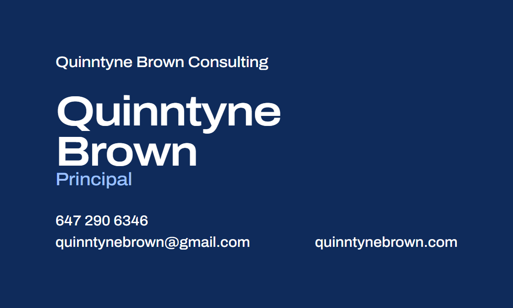
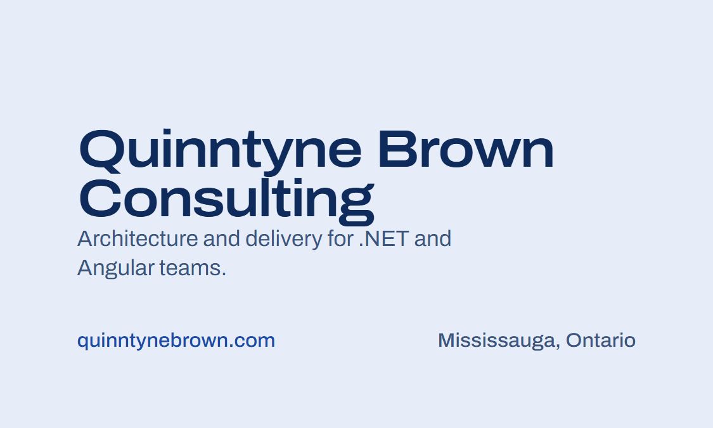

# Quinntyne Brown Consulting business card

This directory holds the print design for the Quinntyne Brown Consulting
business card. The card carries the brand of
[quinntynebrown.com](https://quinntynebrown.com/): the site's navy, its pale
blue tint, its light-blue accent, and its Archivo type, set with the same
weights, widths, and tracking the site uses for its wordmark and headings. It
does not use the workboard's design tokens, which belong to the product rather
than to the consultancy.





## Files

| File | Purpose |
| --- | --- |
| [`business-card.html`](business-card.html) | The design. Open it in a browser to preview both sides at twice life size, toggle the trim and safe-area guides, or print it to PDF. |
| [`business-card.pdf`](business-card.pdf) | The print-ready export: two pages, front then back, each 3.75 × 2.25 in (trim plus bleed), with Archivo embedded as a subset. Send this file to the printer. |
| [`front.png`](front.png), [`back.png`](back.png) | 300 dpi previews of each side at bleed size, 1125 × 675 px. For proofing and for this README, not for print. |
| [`render.mjs`](render.mjs) | Regenerates the PDF and the PNGs from the HTML with a local Chromium. |

## Content

| Field | Value | Where | Source |
| --- | --- | --- | --- |
| Company | Quinntyne Brown Consulting | Front, small wordmark at the top; back, large | Supplied |
| Name | Quinntyne Brown | Front, set on two lines | Supplied |
| Title | Principal | Front, under the name | Supplied |
| Phone | 647 290 6346 | Front, bottom left | Supplied |
| Email | quinntynebrown@gmail.com | Front, bottom left | Site contact section |
| Website | quinntynebrown.com | Front, bottom right; back, bottom left | Supplied as <https://quinntynebrown.com/> |
| Tagline | Architecture and delivery for .NET and Angular teams. | Back, under the company name | Site hero |
| Location | Mississauga, Ontario | Back, bottom right | Site contact section |

The email, tagline, and location were not part of the brief. They appear on the
public site, so the card carries them; each is one line in
`business-card.html` and can be removed without disturbing the layout. The
phone number appears nowhere on the site and is shown exactly as supplied.

## Layout

The front is navy, like the site's hero, with white type. A small wordmark
sits at the top left. The name fills the middle in the site's display style,
two lines set tight, with the title beneath it in the light-blue accent, which
is the only colour on the front besides white. The bottom row holds the phone
number and email at the left and the website at the right, aligned on one
baseline.

The back is the site's pale blue tint with navy type. The company name is set
large on two lines with the tagline beneath it in muted navy. The bottom row
holds the website in link blue at the left and the location in muted navy at
the right.

Every element is left-aligned or sits on the bottom row. Nothing is centred,
and there is no rule, box, or logo: the site has no logo, and the card does not
invent one.

## Dimensions

| Measure | Value |
| --- | --- |
| Trim size | 3.5 × 2 in (88.9 × 50.8 mm), the North American standard |
| Bleed | 0.125 in (3.2 mm) on every edge, so the artwork is 3.75 × 2.25 in |
| Safe area | 0.125 in inside the trim; no type crosses it |
| Text inset | 0.28 in from the trim edge on every side |
| Smallest type | 7.5 pt, the contact lines and the back's bottom row |

Both sides bleed on every edge, so the order is a double-sided, full-bleed card.
The HTML draws the trim line in magenta and the safe area in blue when
**Show guides** is ticked; neither appears in the PDF or the PNGs.

## Colour

| Site token | Hex | CMYK, approximate | Use on the card |
| --- | --- | --- | --- |
| `--ink` | `#0f2b5b` | 84 / 53 / 0 / 64 | Front background; back type |
| `--paper` | `#ffffff` | 0 / 0 / 0 / 0 | Front type |
| `--tint` | `#e6edf8` | 7 / 4 / 0 / 3 | Back background |
| `--accent` | `#9cc0ff` | 39 / 25 / 0 / 0 | The title, "Principal" |
| `--link` | `#1e4aa8` | 82 / 56 / 0 / 34 | The website on the back |
| `--muted` | `#0f2b5b` at 78 % | Tint of `--ink` | Tagline and location on the back |
| `--live` | `#30c67c` | 76 / 0 / 37 / 22 | Not used; reserved for status hues on the site |

The hex values are the site's and are authoritative. The CMYK columns are naive
sRGB conversions for reference only; the printer converts the PDF's RGB with
their own profile. Pantone matches: `<TO SUPPLY>`. The back's tint is light
enough that a cheap digital press may render it as faint banding; if a proof
shows that, ask for a coated stock or drop the tint to plain white by changing
`--tint` in the HTML.

## Typography

Archivo, from [Google Fonts](https://fonts.google.com/specimen/Archivo) under
the SIL Open Font License, is the only face. It is a variable font with a width
axis, which is what gives the site's headings their wide set; the values below
follow the site's own rules.

| Element | Size | Weight | Width | Tracking | Leading |
| --- | --- | --- | --- | --- | --- |
| Name (front) | 22 pt | 600 | 118 % | −0.03 em | 0.94 |
| Company (back) | 20 pt | 600 | 118 % | −0.03 em | 0.94 |
| Title | 9.5 pt | 500 | 110 % | −0.01 em | 1 |
| Tagline | 8.5 pt | 400 | 100 % | 0 | 1.35 |
| Wordmark (front) | 8 pt | 500 | 110 % | −0.01 em | 1 |
| Contact lines and bottom rows | 7.5 pt | 500 | 105 % | 0 | 1.45 |

The HTML loads Archivo from Google Fonts, so a preview without network access
falls back to Segoe UI or Arial and loses the wide set. The PDF embeds the
glyphs it uses, so it needs no font on the printer's side. If a printer asks for
outlined text, ask them to outline the PDF; there is no need to regenerate it.

## Printing

Send `business-card.pdf` and order:

- 3.5 × 2 in, double-sided, full bleed on both sides, trimmed to size.
- A 14 pt to 16 pt (350 to 400 gsm) stock. A solid navy front scuffs on a bare
  uncoated sheet, so choose a coated, silk, or soft-touch finish, or an
  uncoated stock the printer will seal.
- No scaling: the pages are already at bleed size.

Recommended stock and finish: `<TO SUPPLY>` once a proof has been seen.

## Regenerating the exports

```powershell
node render.mjs
```

The script needs Node 22 or later and a Chrome, Edge, or Playwright Chromium
install; it looks in the usual places and takes `--chrome <path>` or
`CHROME_PATH` otherwise. It drives the browser over the DevTools protocol, so
nothing is installed from npm. Archivo comes from Google Fonts, so the first
render on a machine needs network access, and the script warns if the font did
not load. It writes `front.png`, `back.png`, and `business-card.pdf` next to
itself.

A browser's print dialog produces the same PDF: destination "Save as PDF",
scale 100 %, margins "None", "Background graphics" on.

## Open decisions

- Whether the email belongs on the card, or the site alone should carry it.
- Whether to add a QR code for the website on the back. The layout leaves the
  back's top-right quarter free for one.
- Pantone matches and the stock, both marked `<TO SUPPLY>` above.
