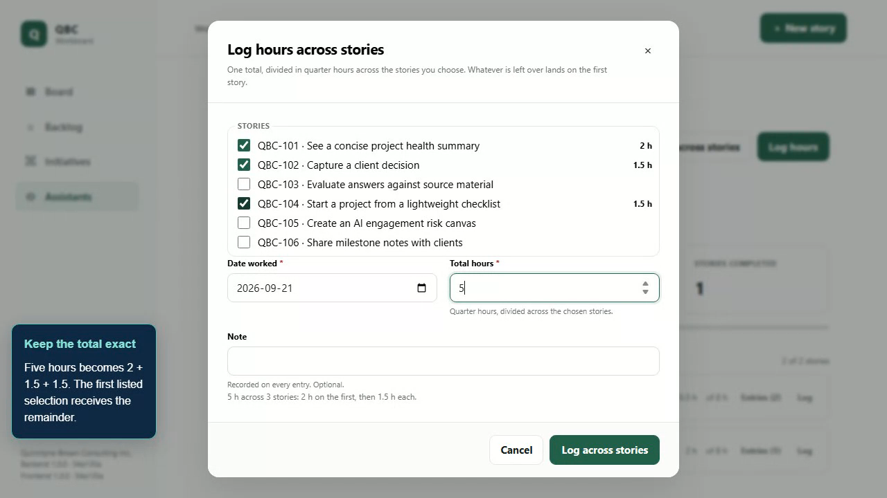

# Group story hours demo

This feature demo records **Log across stories** on branch
`feature/group-time-logging`, revision
`54a135a286d7af6c36b83e3de2e2f37439dc3f2a`. The feature was not yet on the working
`main` branch (`03ff146`) when recorded, so an isolated checkout supplied the
application. No product code was changed for the recording.

[Watch with voice narration](workboard-group-hours-narrated.webm) ·
[Watch the silent original](workboard-group-hours.webm) ·
[Poster](workboard-group-hours-poster.png) ·
[Chapter and verification metadata](workboard-group-hours.chapters.json) ·
[Captions](workboard-group-hours.vtt)



## Application inventory and scope

The request covers the new group-entry browser workflow. All executable
applications were inventoried; independent CLI, API and catalog tours are outside
that scope. There are no standalone first-party workers.

| Application | Purpose and audience | Entrypoint and local command | Dependencies and access | Demo status |
| --- | --- | --- | --- | --- |
| `workboard` | Planning and time recording for consultants and assistants | `frontend/projects/qbc-workboard`; `npm start` in `frontend`, normally port 4200. This recording uses its published bundle at `http://127.0.0.1:5268`. | Angular, real API, shared-passcode session | Recorded: group story hours |
| `workboard-api` | Persistent workspace service for the browser and CLI | `backend/src/Qbc.Workboard.Api/Program.cs`; `dotnet run --project backend/src/Qbc.Workboard.Api --urls http://127.0.0.1:5050` | .NET 10, SQL Server, workspace session; `/api/version` public | Exercised as the recording's real backend; separate API video excluded by scope |
| `workboard-cli` | Database maintenance and work-item authoring for operators | `backend/src/Qbc.Workboard.Cli`; `dotnet run --project backend/src/Qbc.Workboard.Cli -- --help` | .NET 10; SQL Server for maintenance, authenticated API for authoring | Excluded by scope |
| `storybook` | Component and pattern catalog for designers and frontend developers | `frontend/projects/components/.storybook`; `npm run storybook` in `frontend`, `http://localhost:6006` | Node/npm and Storybook; no authentication | Excluded by scope |

## Verified story

The synthetic development seed supplies Noah Williams with 8.5 hours across two
stories. The recording opens his hours page from the assistant directory, selects
QBC-101, QBC-102 and QBC-104, previews three hours as one hour each, then changes
the total to five hours. The preview shows **2 + 1.5 + 1.5 hours**, with the
remainder on the first selected story in list order.

One submission records the date `2026-09-21` and note “Shared delivery review and
follow-up” on all three entries. The real batch endpoint returns HTTP 201. The
UI and an independent authenticated API read confirm 13.5 hours overall, 3.5
hours on completed work, and three stories worked on. Each new entry is expanded
on screen. A full page reload and API read verify persistence, and the Completed
filter narrows the view to QBC-104.

This is one continuous silent take at 1280 × 720, with captions burned into the
recording and an optional WebVTT text equivalent. It uses the actual application,
API, migrations, authentication and SQL Server; no mocked API responses or
external-service substitutions are used. A real unlock request obtains the
session before capture, keeping credentials out of the footage and artifacts.

<!-- group-hours-measurements:start -->
**Measured video:** 98.68 seconds (1:38), 1280 × 720, 4.69 MiB (4,917,396 bytes).

The [poster](workboard-group-hours-poster.png) is a decoded frame at 36.04 seconds. Full normal-speed browser playback completed without media errors. All chapters, captions, important outcomes, the beginning and ending were visually reviewed.

| Time | Verified workflow |
| --- | --- |
| 0:00 | Log hours across stories |
| 0:08 | Start with the assistant |
| 0:15 | Choose the stories |
| 0:26 | Preview equal shares |
| 0:33 | Keep the total exact |
| 0:48 | All three entries saved |
| 1:15 | Still there after reload |
| 1:29 | One total. Three stories. |

Chapter events were measured from capture start and checked against the encoded playback. The subsecond page load at the beginning is retained as part of the continuous take.
<!-- group-hours-measurements:end -->

## Setup and rerun

Run these commands from the repository root in PowerShell 7. Prerequisites:
Windows, Git, Node 22/npm, .NET 10 SDK, a running `.\SQLEXPRESS` instance with
Windows authentication and database create/drop rights, and `sqlcmd` on PATH.
Playwright 1.55.1 is installed from the frontend lockfile. No FFmpeg installation
is needed: Chromium decodes the WebM and exports the poster frame.

```powershell
# Install the recording harness's locked dependencies and Chromium.
Push-Location frontend
npm ci
npx playwright install chromium
Pop-Location

# Use this exact feature revision when main does not contain the feature.
# Omit this command if this owned worktree already exists from the original run.
git worktree add --detach artifacts/demo-worktree 54a135a286d7af6c36b83e3de2e2f37439dc3f2a

# Installs/builds the feature checkout and publishes the real API + frontend.
pwsh -NoProfile -File eng/scripts/Record-GroupHoursDemo.ps1 -SourceRoot artifacts/demo-worktree

# Use the exact directory printed by the recording command.
$run = 'artifacts/demo-runs/<printed-run-id>'
node frontend/scripts/demo/review-group-hours.mjs $run

# Watch the encoded WebM at normal speed; inspect each chapter, start/end,
# captions, preview shares, saved entries and reload. The review/ directory
# contains decoded chapter frames and frames taken during full-speed playback.
Invoke-Item "$run/workboard-group-hours.webm"

# Promote the verified video/poster/chapters/captions together after review.
node frontend/scripts/demo/promote-group-hours.mjs $run --reviewed
```

Once the feature is on the current branch, `-SourceRoot .` records that source.
Use `-SkipBuild` only with an already published matching feature build.
`-Port 5269` selects a different unused local port. The script refuses to reuse
a listening server. One command supplies all prerequisites for the story; no
earlier demo is required.

The runner creates a unique `QbcDemo_<32 hex digits>` database, sets
`ConnectionStrings__Workboard`, enables `SeedDevelopmentData`, and generates
`Access__InitialPasscode` for that run. It passes `DEMO_BASE_URL`, `DEMO_RUN_DIR`
and `DEMO_SOURCE_REVISION` to the harness. Existing process environment values
are restored in `finally`. The API binds only to loopback, and the recording
asserts its source revision before proceeding.

Background processes launch hidden and are tracked from startup. Setup, startup,
actions, navigation, the whole take and cleanup have finite timeouts. Cleanup
stops owned process trees and drops only the generated demo database, including
on failed takes. Logs, provisional footage and screenshots stay under ignored
`artifacts/demo-runs/`; the isolated checkout and build remain under ignored
`artifacts/demo-worktree/` for reruns. No running services or demo databases are
needed to play the delivered video.

The capture script is separate from ordinary acceptance tests, has no automatic
retries, and asserts actual UI and API results. Failed recordings are not
published. Promotion backs up an existing artifact set and restores it if
replacement fails; a failed rerun leaves any prior verified demo intact. Manual
README content and unrelated recordings are preserved.

## Sources and recording implementation

- [Recording runner](../../eng/scripts/Record-GroupHoursDemo.ps1)
- [Continuous browser story and assertions](../../frontend/scripts/demo/group-hours.mjs)
- [Encoded-video playback, measurements and poster extraction](../../frontend/scripts/demo/review-group-hours.mjs)
- [Artifact promotion](../../frontend/scripts/demo/promote-group-hours.mjs)
- [Feature design at recorded revision](https://github.com/QuinntyneBrown/quinntyne-brown-consulting/blob/54a135a286d7af6c36b83e3de2e2f37439dc3f2a/docs/detailed-designs/work-items/log-hours-across-stories/README.md)
- [L2-058 browser acceptance coverage at recorded revision](https://github.com/QuinntyneBrown/quinntyne-brown-consulting/blob/54a135a286d7af6c36b83e3de2e2f37439dc3f2a/frontend/e2e/tests/assistant-hours.spec.ts)
- [API time-entry acceptance coverage at recorded revision](https://github.com/QuinntyneBrown/quinntyne-brown-consulting/blob/54a135a286d7af6c36b83e3de2e2f37439dc3f2a/backend/tests/Qbc.Workboard.Api.IntegrationTests/Acceptance/TimeEntryAcceptanceTests.cs)

The saved shares remain ordinary editable entries; there is no persistent group
record. Totals must be quarter-hour increments, at most 24 hours, and large
enough to give every selected story at least a quarter hour. Invalid submissions
and concurrent edits are not part of this focused successful workflow.

## Voice narration

The [narrated version](workboard-group-hours-narrated.webm) adds English synthetic
speech using **Microsoft Zira Desktop**, synthesized locally with Windows
System.Speech at rate 1. The original video stream is copied unchanged, so the
poster, chapters, captions and verified product behavior above still apply. No
script or footage was sent to an external speech service.

Thirteen timed lines explain selecting the stories, equal and remainder splits,
the shared note, saved entries and persistence after reload. Each line fits
inside its matching scene with pauses between lines. Audio is mono Opus at
48 kHz and 96 kbps, normalized to a peak of -3 dBFS before encoding with no
clipped source samples. The narrated file is approximately 99 seconds and
5.61 MiB (5,884,960 bytes). Its [narration subtitles](workboard-group-hours-narrated.vtt)
match the spoken script.

The [verification report](workboard-group-hours-narrated.verification.json)
records measured speech durations, complete audio/video decoding, an identical
compressed video-stream hash, and a full normal-speed browser playback check
that detects speech in all thirteen scenes. The original silent video is retained.

To regenerate from the existing silent recording, use the following commands
from the repository root. This requires Windows System.Speech with the named
voice, Python 3, the existing frontend Playwright dependencies, and a full FFmpeg
build with Opus support. The optional dependency commands extract FFmpeg 7.1
from the pinned imageio-ffmpeg wheel into ignored local tooling storage.

```powershell
New-Item -ItemType Directory -Path artifacts/narration-tools -Force | Out-Null
python -m pip download imageio-ffmpeg==0.6.0 --only-binary=:all: --platform win_amd64 --no-deps -d artifacts/narration-tools
python -c "from pathlib import Path; import zipfile; p=Path('artifacts/narration-tools'); z=zipfile.ZipFile(p/'imageio_ffmpeg-0.6.0-py3-none-win_amd64.whl'); n=next(n for n in z.namelist() if n.endswith('.exe')); z.extract(n,p)"
pwsh -NoProfile -File eng/scripts/Add-GroupHoursNarration.ps1 -Ffmpeg artifacts/narration-tools/imageio_ffmpeg/binaries/ffmpeg-win-x86_64-v7.1.exe

# Use the exact staged directory printed by the command.
$run = 'artifacts/narration-runs/<printed-run-id>'
node frontend/scripts/demo/review-narration.mjs $run
Invoke-Item "$run/workboard-group-hours-narrated.webm"
```

After review, promote the staged narrated WebM, narration subtitles and verification
report to this directory together; retain any previous set as a backup before replacement.
The source [narration script](workboard-group-hours.narration.json) contains the
text and scene windows. [Speech generation](../../eng/scripts/Add-GroupHoursNarration.ps1)
and [audio mixing](../../eng/scripts/Mix-GroupHoursNarration.py) are reproducible;
all temporary audio and intermediate files remain in ignored
`artifacts/narration-runs/`. The narration process does not start the application
or use its database.
