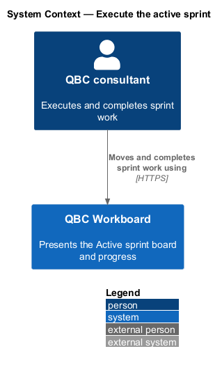
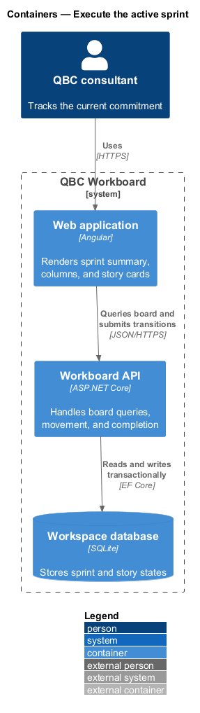
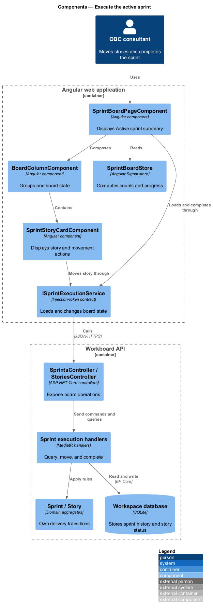
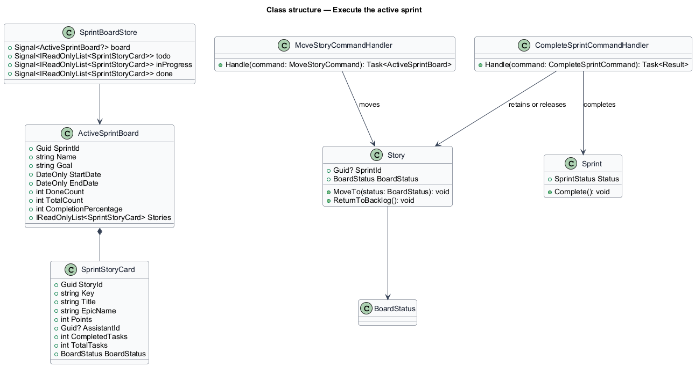
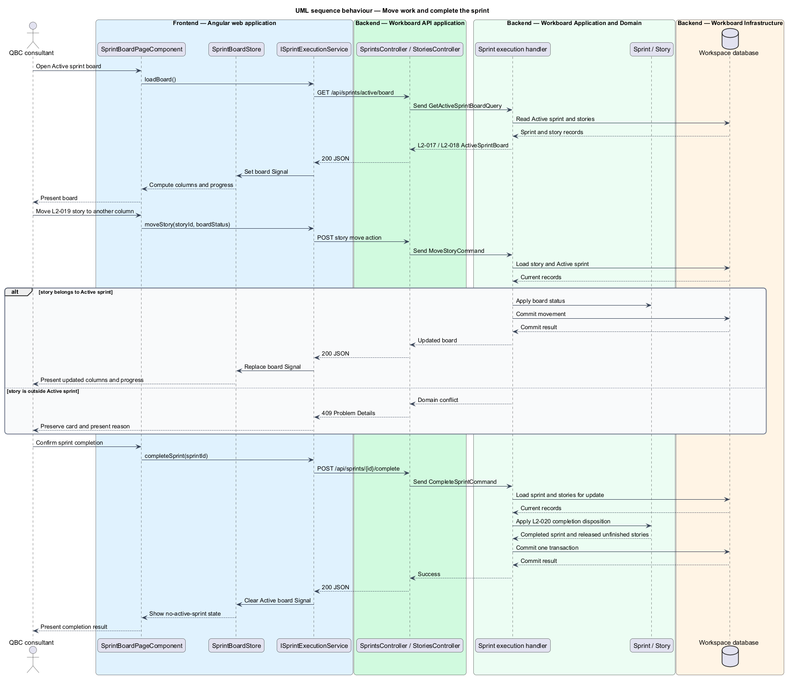

# Execute the active sprint

## Overview

The sprint board presents the work committed to the single Active sprint. It
uses three workflow states: To do, In progress, and Done. Each story appears in
exactly one column.

*board status* — delivery state of a story within an Active sprint

*sprint progress* — whole-number percentage of sprint stories currently in Done

*completion disposition* — treatment of each story when the Active sprint
becomes Completed

The board supports explicit movement controls on every device. Pointer dragging
provides an additional interaction without replacing keyboard and touch controls.
Sprint completion preserves Done membership as history and returns unfinished
stories to the Ready backlog.

## Description

The feature runs from the board route through story movement and sprint
completion transactions.

- **`SprintBoardPageComponent`** — Angular route component that renders the Active
  sprint summary and three board columns.
- **`BoardColumnComponent`** — accessible story-card collection for one
  `BoardStatus` value.
- **`SprintStoryCardComponent`** — card displaying key, title, epic, estimate,
  owner, task progress, and movement actions.
- **`SprintBoardStore`** — Signal state containing the board projection and
  computed counts and completion percentage.
- **`ISprintExecutionService`** — token-backed contract for board retrieval,
  movement, and sprint completion.
- **`SprintExecutionService`** — HTTP implementation that applies authoritative
  server results to board Signals.
- **`SprintsController`** — controller exposing the Active board query and
  completion action.
- **`StoriesController`** — controller exposing the explicit board-movement
  action.
- **`GetActiveSprintBoardQueryHandler`** — handler that creates the board summary
  and three story projections.
- **`MoveStoryCommandHandler`** — handler that permits movement only inside the
  Active sprint.
- **`CompleteSprintCommandHandler`** — handler that completes the sprint and
  applies each story's completion disposition atomically.

The board store calculates presentation groupings from one server projection.
The backend remains authoritative for transitions and percentage inputs.

## Requirements

The feature realizes the following level-2 (L2) requirements. Each L2
requirement refines one level-1 (L1) requirement.

| L2 ID | Refines (L1) | Requirement |
|-------|--------------|-------------|
| `L2-017` | `L1-007` | The board shall identify the Active sprint and summarize its goal, inclusive date range, story completion count, and completion percentage. |
| `L2-018` | `L1-007` | The board shall have To do, In progress, and Done columns. Each sprint story shall appear in exactly one column. |
| `L2-019` | `L1-007` | The user shall be able to move an Active-sprint story among To do, In progress, and Done with controls that do not depend on drag-and-drop. |
| `L2-020` | `L1-007` | Completing a sprint shall preserve Done stories in sprint history and return unfinished stories to the Ready backlog. |

## Diagrams

### System context

The consultant executes the current commitment through the QBC Workboard sprint
board.

### Containers

The Angular board calls the API for current state and transitions. The API
persists movement and completion outcomes.

### Components

Board components read one Signal store and call a token-backed execution service.
Backend handlers enforce the Active-sprint boundary.

### Class structure

The board projection contains sprint summary and story-card data. Command handlers
change the `Story` and `Sprint` aggregates.

### Behaviour — move work and complete the sprint

The sequence shows story movement and the completion transaction. The completion
branch retains Done stories and releases unfinished work.

