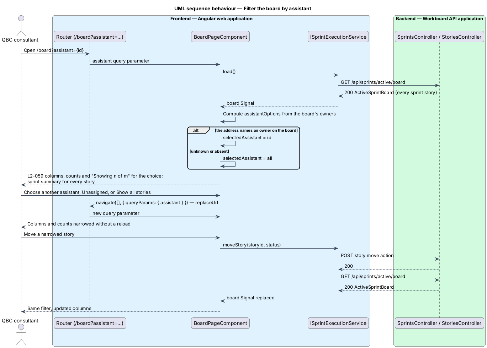

# Filter the board by assistant

## Overview

The sprint board shows every story committed to the Active sprint. When several
assistants share a sprint, a consultant often wants to see one assistant's work
on its own: what that assistant still has To do, what is In progress, and what
is Done. This feature adds an assistant filter to the board.

*assistant filter* — a single choice above the board columns that narrows them
to the stories one assistant owns, or to the stories that have no owner

*board owner* — an assistant who owns at least one story on the Active sprint
board

*narrowed board* — the board while the assistant filter is anything other than
All assistants

The filter only changes which cards the columns show. The sprint summary above
it keeps describing the whole sprint, because the sprint's goal and progress
belong to the team rather than to one assistant. The choice lives in the board's
address as `?assistant={assistant id}` or `?assistant=unassigned`, so a refresh
or a shared link opens the same view. The feature needs no backend change: the
Active board projection already carries each story's `assistantId` and
`assistantName`.

The interaction study is
[`docs/mocks/board-assistant-filter.html`](../../../mocks/board-assistant-filter.html).
The board itself is designed in
[Execute the active sprint](../execute-active-sprint/README.md).

## Description

The slice lives entirely in the board feature of the Angular application.

- **`BoardPageComponent`** — route component for `/board`. It reads the
  `assistant` query parameter as a Signal, derives the filter choices and the
  narrowed stories from the board Signal with `computed`, and renders the filter
  between the sprint hero and the columns. Choosing a value navigates to the same
  route with the new query parameter, replacing the history entry; All assistants
  removes the parameter.
- **`assistantOptions`** — computed list of `SelectOption` values: `all`
  (All assistants), each board owner's `assistantId` in name order, then
  `unassigned` when any board story has no owner. Each label ends with the number
  of board stories that choice leaves, for example `Ava Chen (3)`.
- **`selectedAssistant`** — computed choice. It is the query parameter when that
  value is one of the options, and `all` otherwise, so an unknown or departed
  assistant in the address falls back to every story.
- **`visibleStories`** — computed stories that match the choice. `stories(status)`
  groups these, not the whole board, so each column's cards, count, and empty
  state follow the filter.
- **Filter summary** — on a narrowed board, the text "Showing *n* stories of *m*"
  and a **Show all stories** action that returns to All assistants.
- **`qbc-select`** — the existing design-system select, labelled
  "Filter board by assistant" for assistive technology.
- **`ISprintExecutionService`** — unchanged. `load()` and `moveStory()` replace
  the board Signal; the filter recomputes from it, so a move keeps the choice.

## Requirements

The feature realizes the following level-2 (L2) requirements. Each L2
requirement refines one level-1 (L1) requirement.

| L2 ID | Refines (L1) | Requirement |
|-------|--------------|-------------|
| `L2-059` | `L1-007` | The board shall let the user narrow its columns to the stories owned by one assistant, or to the stories that have no owner, while the sprint summary keeps describing the whole sprint, and shall hold the choice in the board's address. |

## Diagrams

### Context, containers, and components

The filter adds no new system, container, or backend component. The views in
[Execute the active sprint](../execute-active-sprint/README.md#diagrams) still
describe the board.

### Behaviour — open, narrow, and move

The page reads the choice from the address once the board loads, falls back to
all stories for an unknown assistant, and recomputes the columns from the
replaced board Signal after a move.

