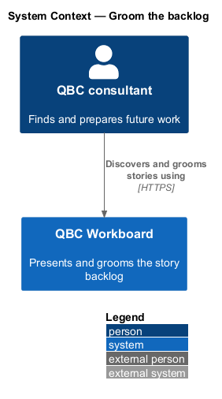
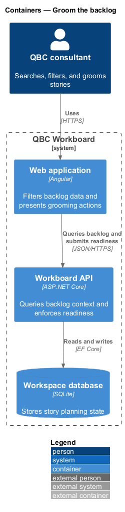
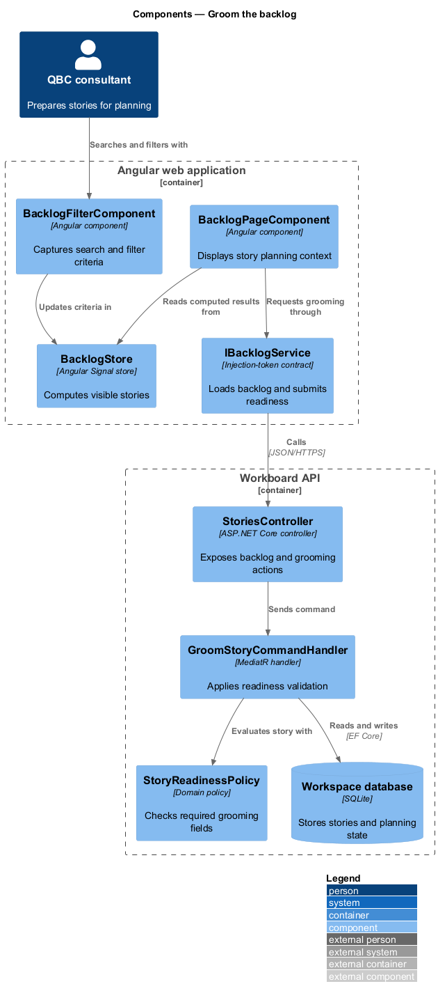
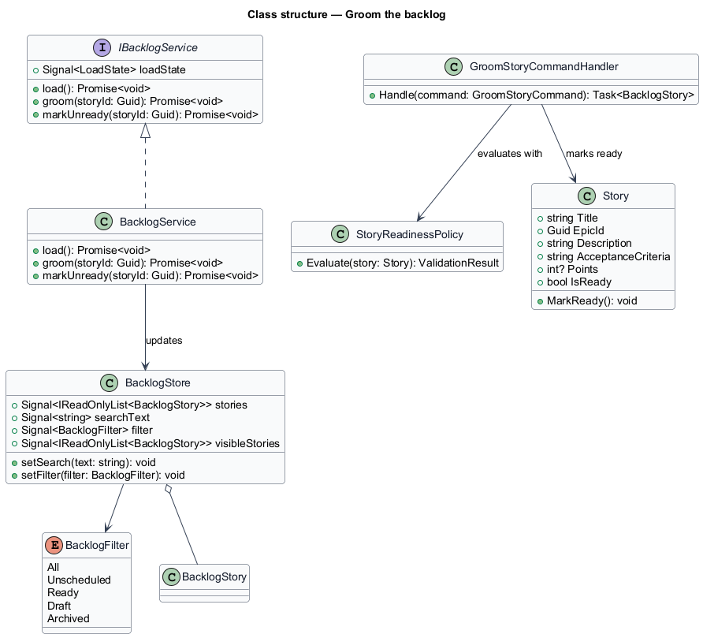
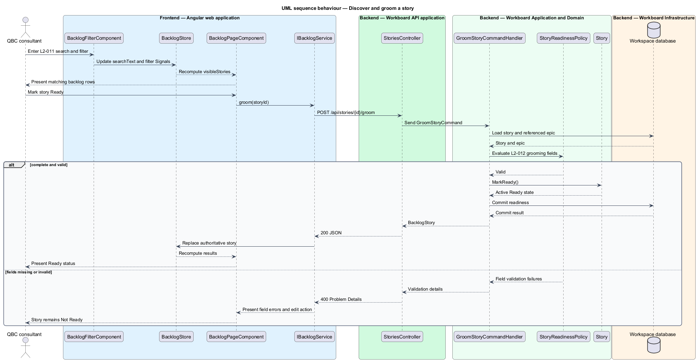

# Groom the backlog

## Overview

The backlog holds stories before and between sprint commitments. It provides the
working surface for finding, completing, estimating, and preparing stories.

*grooming* — review that completes the information needed to plan a story

*Ready story* — active, non-archived story with a valid epic, description,
acceptance criteria, and accepted estimate

*sprint disposition* — unscheduled, planned, active, or historically completed
placement of a story

This feature combines rapid client-side discovery with server-enforced readiness.
Search and filters do not change persisted data. Grooming is a domain transition
that succeeds only when the backend validates every readiness field.

## Description

The backlog slice spans an Angular route, a Signal store, story query and
grooming endpoints, domain validation, and persistence.

- **`BacklogPageComponent`** — Angular route component that displays backlog rows,
  search, filters, readiness actions, and sprint disposition.
- **`BacklogFilterComponent`** — accessible search and filter controls whose
  values update Signals.
- **`BacklogStore`** — Signal state for the loaded stories, query text, selected
  filter, and computed visible results.
- **`IBacklogService`** — token-backed contract for backlog retrieval, grooming,
  and readiness reversal.
- **`BacklogService`** — HTTP implementation that applies server results to the
  store.
- **`StoriesController`** — controller exposing backlog queries and explicit
  `groom` and `mark-unready` actions.
- **`GetBacklogQueryHandler`** — query handler that returns hierarchy and sprint
  context with each story.
- **`GroomStoryCommandHandler`** — command handler that invokes domain readiness
  validation before persistence.
- **`MarkStoryUnreadyCommandHandler`** — handler that rejects the transition while
  the story belongs to a planned or active sprint.
- **`StoryReadinessPolicy`** — domain policy for the complete grooming field set.

The store applies case-insensitive matching to story key, title, and epic name.
It computes All, Unscheduled, Ready, Draft, and Archived result sets from one
server-authoritative collection.

## Requirements

The feature realizes the following level-2 (L2) requirements. Each L2
requirement refines one level-1 (L1) requirement.

| L2 ID | Refines (L1) | Requirement |
|-------|--------------|-------------|
| `L2-011` | `L1-005` | The backlog shall show stories with their key, title, hierarchy context, lifecycle or readiness, estimate, and sprint disposition. |
| `L2-012` | `L1-005` | A story shall become Ready only when it has a title, valid epic, non-blank description or user story, non-blank acceptance criteria, and valid story-point estimate. |

## Diagrams

### System context

The consultant discovers and grooms stories through the QBC Workboard backlog.

### Containers

The Angular application filters its loaded projection and sends readiness
commands to the API. The API persists valid transitions.

### Components

The backlog page reads computed Signal state and delegates readiness commands to
the service. The handler applies the domain readiness policy.

### Class structure

The class model separates local discovery criteria from the server-owned
readiness transition.

### Behaviour — discover and groom a story

Client-side search narrows the existing projection. Grooming crosses the API and
returns either the Ready story or field-specific validation details.

