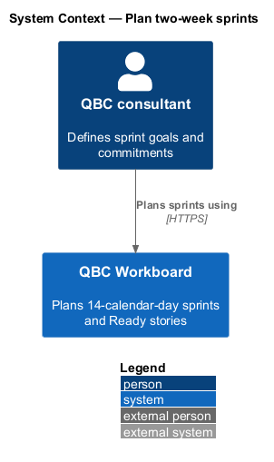
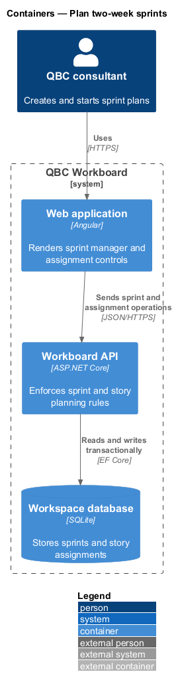
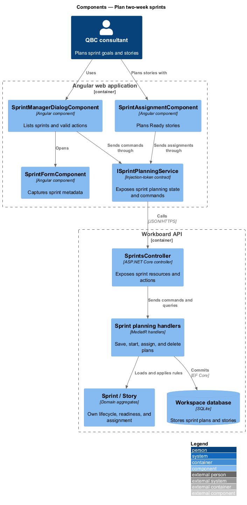
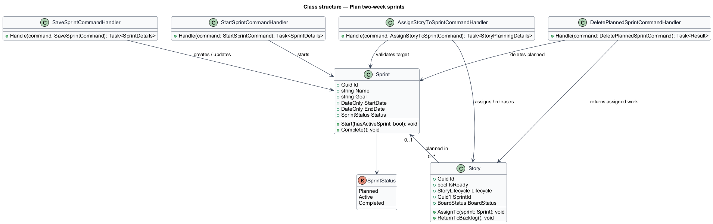
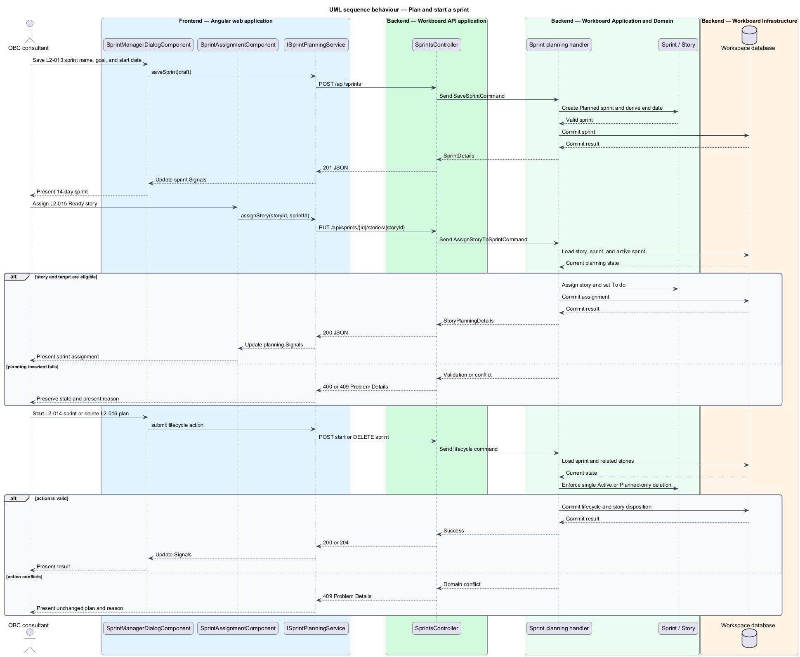

# Plan two-week sprints

## Overview

A sprint is a fixed 14-calendar-day planning interval with one outcome-oriented
goal. A planned sprint holds eligible stories before work begins. Starting a
sprint makes it the single active delivery interval.

*Planned sprint* — editable future sprint that may accept Ready stories

*Active sprint* — sole sprint currently available for board execution

*Completed sprint* — retained historical sprint whose completed membership no
longer participates in planning

The feature manages sprint identity, inclusive dates, lifecycle, story planning,
and guarded deletion. The system derives the end date as 13 calendar days after
the start date. It permits only one Active sprint.

## Description

The planning slice combines sprint management and backlog assignment.

- **`SprintManagerDialogComponent`** — Angular dialog listing Planned, Active,
  and Completed sprints with valid actions for each status.
- **`SprintFormComponent`** — external-template form for sprint name, goal, and
  start date.
- **`SprintAssignmentComponent`** — backlog control that assigns a Ready story to
  a Planned or Active sprint or returns it to the backlog.
- **`ISprintPlanningService`** — token-backed contract for sprint commands,
  queries, and assignments.
- **`SprintPlanningService`** — HTTP implementation that updates sprint and
  backlog Signals from responses.
- **`SprintsController`** — controller for sprint resources, start, assignment,
  and planned deletion actions.
- **`SaveSprintCommandHandler`** — MediatR handler that validates unique names and
  derives the inclusive end date.
- **`StartSprintCommandHandler`** — handler that enforces the single Active sprint
  invariant.
- **`AssignStoryToSprintCommandHandler`** — handler that checks lifecycle,
  readiness, archival, and historical membership.
- **`DeletePlannedSprintCommandHandler`** — handler that returns assigned stories
  to the Ready backlog in one transaction.
- **`Sprint`** — aggregate root containing name, goal, dates, status, and lifecycle
  transitions.

Completed sprint corrections accept only name or goal changes. Date, status, and
completed membership changes return `409 Conflict`.

## Requirements

The feature realizes the following level-2 (L2) requirements. Each L2
requirement refines one level-1 (L1) requirement.

| L2 ID | Refines (L1) | Requirement |
|-------|--------------|-------------|
| `L2-013` | `L1-006` | A sprint shall contain an ID, unique name, non-blank goal, start date, derived end date, and status of Planned, Active, or Completed. |
| `L2-014` | `L1-006` | The system shall allow at most one Active sprint and shall enforce the Planned → Active → Completed lifecycle. |
| `L2-015` | `L1-006` | The user shall be able to assign eligible stories to a Planned or Active sprint and return eligible stories to the backlog. |
| `L2-016` | `L1-006` | Only a Planned sprint may be deleted. |

## Diagrams

### System context

The consultant creates sprint goals and plans Ready stories within QBC
Workboard.

### Containers

The Angular planning controls call the API. The API enforces sprint and story
invariants before committing the workspace transaction.

### Components

The sprint manager and assignment control consume one planning contract. Handlers
coordinate the `Sprint` and `Story` aggregates through persistence.

### Class structure

The class model separates sprint lifecycle from story readiness and board status.
The assignment handler coordinates both aggregates.

### Behaviour — plan and start a sprint

The sequence covers sprint creation, story assignment, activation, and guarded
planned deletion. Alternate paths return validation or conflict details.

