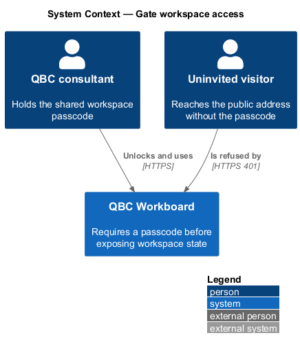
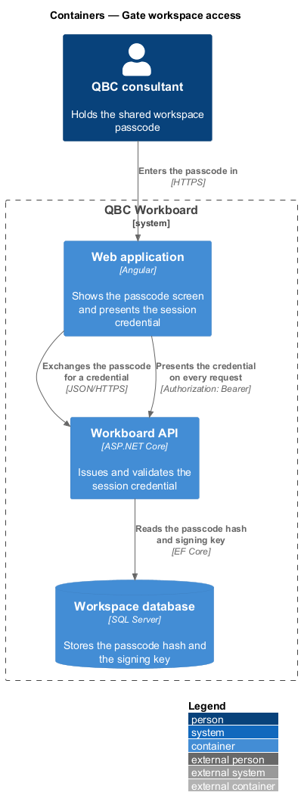
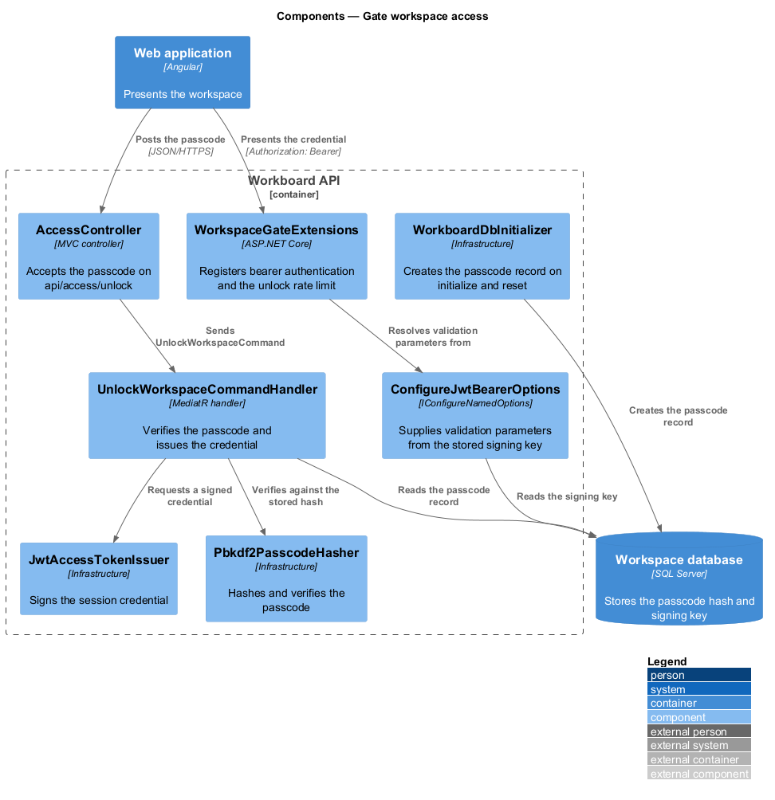
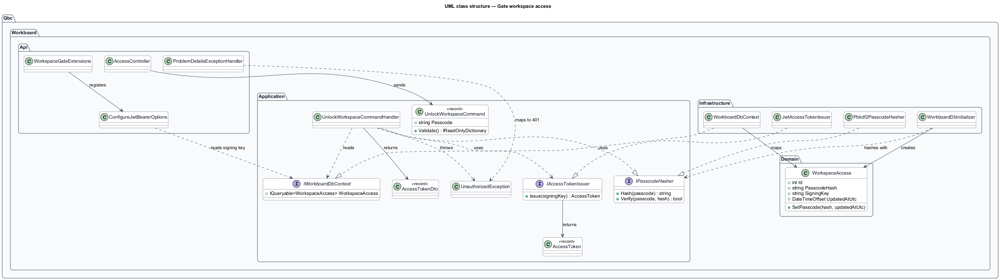
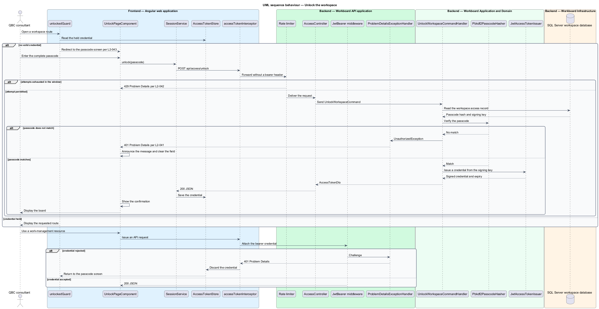

# Gate workspace access

## Overview

The workspace is deployed to a public address. A single shared passcode stands in front of
it, and every work-management resource requires the session credential that the passcode
buys. The gate keeps a public deployment private among the people who hold the passcode; it
is not user authentication.

*passcode* — one short shared secret that opens the whole workspace for anyone who knows it

*session credential* — signed, time-limited bearer token that a client presents on each
request instead of resending the passcode

*signing key* — random secret used to sign and verify the session credential, generated with
the database rather than supplied by configuration

*rate limit window* — fixed period during which one caller may make a bounded number of
passcode attempts

The gate uses ASP.NET Core bearer authentication, the framework rate limiter, PBKDF2 passcode
hashing from the base class library, and Angular route guarding with an HTTP interceptor. The
passcode hash and the signing key live in one database row created during database
initialization, so no secret is committed to source control or supplied as a deployment
setting.

A four-digit passcode has ten thousand combinations. Hashing does not change that arithmetic:
the attempt throttle is what makes guessing impractical, and the hash only protects the
passcode if the database itself is disclosed.

## Description

- **`WorkspaceAccess`** — single-row domain entity holding the passcode hash, the signing
  key, and the moment the passcode last changed.
- **`IPasscodeHasher`** — Application contract for hashing and verifying the passcode.
- **`Pbkdf2PasscodeHasher`** — Infrastructure implementation using PBKDF2 over SHA-256 with a
  per-record salt and a fixed-time comparison.
- **`IAccessTokenIssuer`** and **`AccessToken`** — Application contract and result for
  minting a signed, time-limited credential.
- **`JwtAccessTokenIssuer`** — Infrastructure implementation signing the credential with the
  stored key.
- **`UnlockWorkspaceCommand`** — Application command carrying the submitted passcode and
  validating its shape before a handler runs.
- **`UnlockWorkspaceCommandHandler`** — verifies the passcode and issues the credential, or
  raises `UnauthorizedException`.
- **`UnauthorizedException`** — typed Application failure mapped to HTTP 401.
- **`AccessController`** — anonymous, rate-limited controller exposing `api/access/unlock`.
- **`WorkspaceGateExtensions`** — API composition of bearer authentication, authorization,
  and the unlock rate-limit policy.
- **`ConfigureJwtBearerOptions`** — supplies bearer validation parameters from the stored
  signing key and answers a challenge with Problem Details.
- **`WorkboardDbInitializer`** — creates the workspace access record on every initialize and
  reset, before and independently of representative data seeding.
- **`AccessTokenStore`** — Angular transport service holding the credential for the browser
  and exposing it as a signal.
- **`accessTokenInterceptor`** — attaches the credential to API requests and discards a
  credential the server rejects.
- **`SessionService`** — application service exposing whether the workspace is unlocked.
- **`unlockedGuard`** — route guard sending a locked visitor to the passcode screen.
- **`UnlockPageComponent`** — full-page passcode screen rendered outside the workspace chrome.
- **`PasscodeInputComponent`** — `@qbc/components` field presenting fixed-length numeric entry.

Only controller endpoints require authorization. Static files and the single-page application
fallback stay anonymous, because the passcode screen is itself served from them.

## Requirements

The feature realizes the following level-2 (L2) requirements. Each L2 requirement refines one
level-1 (L1) requirement.

| L2 ID | Refines (L1) | Requirement |
|-------|--------------|-------------|
| `L2-041` | `L1-013` | Every `/api` work-management resource shall require a valid workspace session credential. The backend shall issue that credential only in exchange for the shared passcode, shall store the passcode as a salted hash rather than a recoverable value, and shall create the passcode record on every database initialization and reset so a usable workspace is never left without one. |
| `L2-042` | `L1-013` | The unlock resource shall limit how many passcode attempts one caller may make in a fixed window and shall reject further attempts in that window without evaluating the passcode. |
| `L2-043` | `L1-013` | The Angular application shall present a full-page passcode screen outside the workspace chrome, shall send the visitor there whenever no valid session credential is held, and shall return to the board after a brief confirmation once the passcode is accepted. |

## Diagrams

### System context

A consultant who holds the passcode uses the workspace. A visitor who reaches the same public
address without it is refused.

### Containers

The Angular application exchanges the passcode for a credential and presents that credential
on every later request. The API reads the passcode hash and signing key from the workspace
database.

### Components

The controller sends one command through the MediatR pipeline to a handler that verifies the
passcode and issues the credential. Bearer validation parameters come from the same stored
signing key, and the database initializer creates the record they both depend on.

### Class structure

The class model shows the single-row domain entity, the Application contracts for hashing and
issuing, and the Infrastructure implementations that satisfy them.

### Behaviour — unlock the workspace

The sequence follows a locked visitor through redirection, throttling, passcode verification,
credential issue, and the later rejection of a credential the server no longer accepts.

