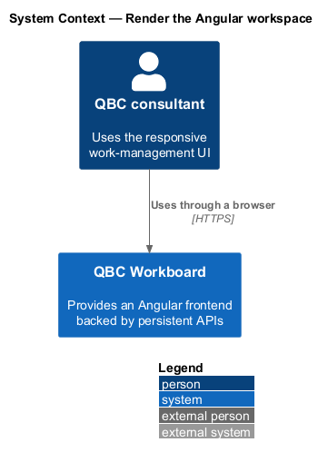
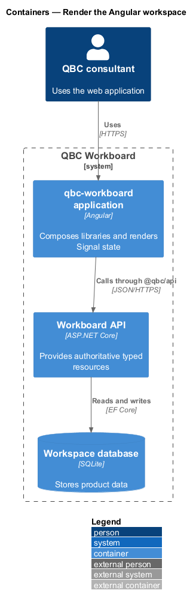
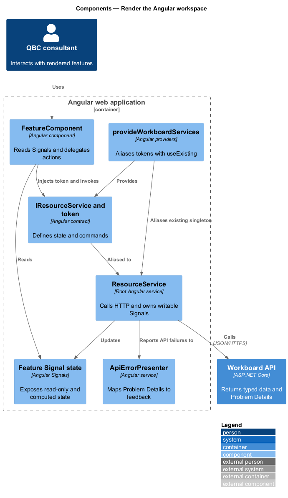
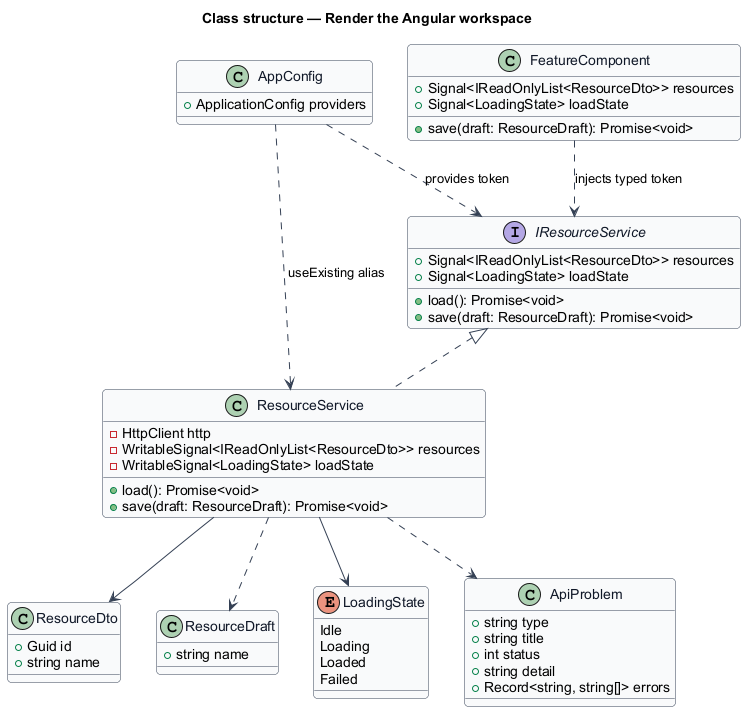
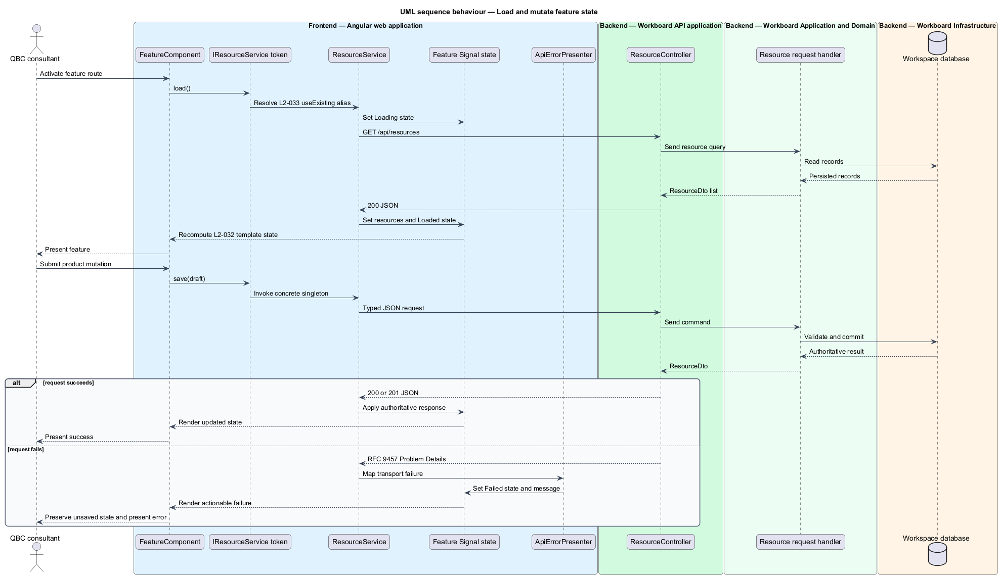

# Render the Angular workspace

## Overview

The frontend is a responsive Angular workspace that renders server-authoritative
work-management data. The workspace separates deployable application behavior,
backend communication, and reusable presentation into three Angular projects.

*runnable application* — browser application that owns routes, feature behavior,
and Signal state

*backend service* — typed service that converts an `HttpClient` operation to a Promise
at the transport boundary

*component library* — collection of reusable presentational components without
product workflow state

The `qbc-workboard` application reads feature state through interface-backed
services. Each feature service delegates transport operations to `@qbc/api` and
applies authoritative responses to Signals. Pages compose reusable controls from
`@qbc/components`.

## Description

The `frontend/` workspace contains three projects with one-way dependencies.
The `qbc-workboard` application depends on `api` and `components`. Neither
library imports application source, and the two libraries remain independent.

- **`qbc-workboard`** — runnable Angular application under
  `projects/qbc-workboard`. It owns routing, feature pages, forms, application
  orchestration, feedback, loading state, and writable or computed Signals.
- **feature service contracts** — `I`-prefixed interfaces paired with typed
  `InjectionToken` values. Components inject these tokens instead of concrete
  feature services.
- **feature services** — root application services such as `BacklogService`.
  They own Signal state and delegate HTTP work to API contract tokens.
- **`@qbc/api`** — Angular library under `projects/api`. It owns backend DTOs,
  feature-oriented HTTP clients, API contract tokens, and Problem Details
  presentation.
- **`provideQbcServices`** — provider factory that registers `HttpClient` and
  aliases backend service tokens to their singletons with `useExisting`.
- **`@qbc/components`** — Angular library under `projects/components`. It
  exports `ConfirmDialogComponent`, `PageHeaderComponent`,
  `EmptyStateComponent`, and `StatusPillComponent`.
- **`provideQbcWorkboard`** — application provider factory that aliases each
  feature contract token to its Signal service singleton with `useExisting`.

Each component uses sibling `.ts`, `.html`, and `.scss` files. `HttpClient`
Observables terminate inside the API library through `firstValueFrom`. The API
backend services return typed Promises, and application services translate results into
Signal state. Product records remain server-authoritative and do not use browser
storage.

## Requirements

The feature realizes the following level-2 (L2) requirements. Each L2
requirement refines a level-1 (L1) requirement, cited by identifier.

| L2 ID | Refines (L1) | Requirement |
|-------|--------------|-------------|
| `L2-031` | `L1-011` | The `frontend/` folder shall contain an Angular application organized by feature. Components shall use separate `.ts`, `.html`, and style files; inline templates and inline styles are prohibited. |
| `L2-032` | `L1-011` | Angular Signals shall be the primary mechanism for feature state, derived state, loading state, selection, and template reactivity. RxJS shall be confined to APIs that require it, such as `HttpClient`, and converted at the service or store boundary. |
| `L2-033` | `L1-011` | Frontend consumers shall depend on behavioral service interfaces and typed Angular `InjectionToken`s, not concrete service classes, following the referenced interface-driven service-consumption pattern. |
| `L2-034` | `L1-011` | The Angular application shall consume the documented backend API through typed, feature-oriented service contracts and shall not use localStorage as the product data repository. |

## Diagrams

### System context

The consultant operates QBC Workboard through a browser. QBC Workboard presents
the Angular workspace and persists product data through its API.

### Containers

The browser downloads the `qbc-workboard` application. The application calls the
ASP.NET Core API, which owns persistence in SQL Server Express.

### Components

The runnable application composes API and component libraries. Application
services retain Signal state while typed backend services isolate `HttpClient`.

### Class structure

The backlog slice illustrates both contract boundaries. `BacklogService`
implements the application contract and consumes the API library's
`IStoryService` through its token.

### Behaviour — load and mutate feature state

The backlog page delegates loading and grooming through application and API
contracts. The API response updates Signals before Angular renders the result.

