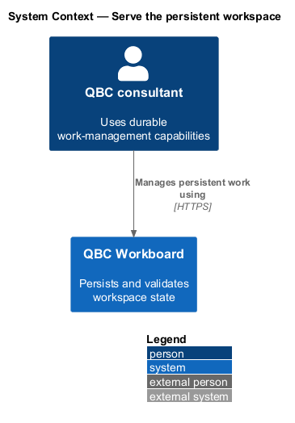
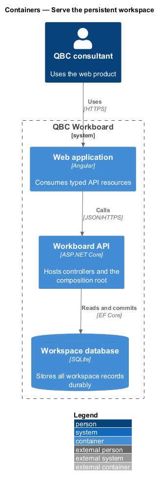
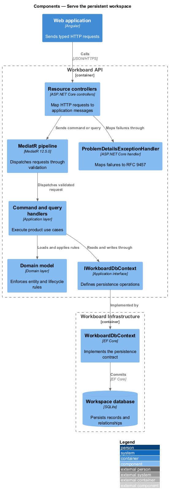
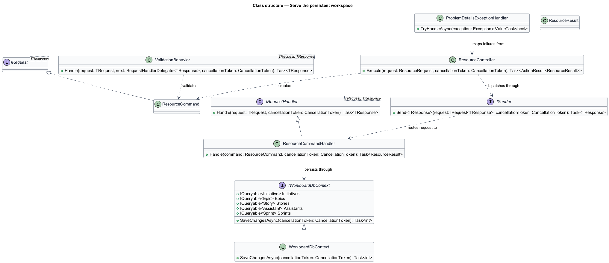
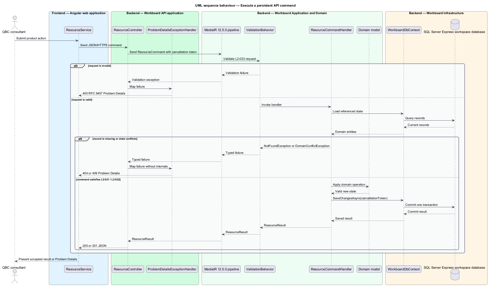

# Serve the persistent workspace

## Overview

The backend is the system of record for every work-management record and
transition. It exposes controller-based HTTP resources and protects domain
relationships in transactions.

*Clean Architecture* — dependency structure in which Domain and Application do
not depend on delivery or persistence technology

*application request* — command or query dispatched through MediatR to one
handler

*unit of work* — transaction boundary that commits all changes or none

The backend uses .NET, ASP.NET Core controllers, MediatR 12.5.0, Entity Framework
Core, and SQL Server Express. SQL Server Express provides the persistent store for the single-workspace
product. The API returns RFC 9457 Problem Details for validation and failure
responses.

## Description

The `backend/` solution separates four projects with inward dependencies.

- **`Qbc.Workboard.Domain`** — entities, value objects, enumerations, and domain
  policies without framework or persistence dependencies.
- **`Qbc.Workboard.Application`** — commands, queries, handlers, validators,
  projections, and persistence interfaces.
- **`Qbc.Workboard.Infrastructure`** — EF Core `WorkboardDbContext`, SQL Server
  mappings, migrations, repositories, and unit-of-work implementation.
- **`Qbc.Workboard.Api`** — composition root, ASP.NET Core controllers,
  Problem Details mapping, OpenAPI, and dependency injection.
- **`WorkboardDbContext`** — EF Core context that maps initiatives, epics,
  stories, tasks, assistants, and sprints.
- **`IWorkboardDbContext`** — Application-layer persistence contract used by
  request handlers.
- **`ValidationBehavior<TRequest,TResponse>`** — MediatR pipeline behavior that
  rejects invalid requests before handler execution.
- **`DomainConflictException`** — typed Application failure mapped to HTTP 409.
- **`NotFoundException`** — typed Application failure mapped to HTTP 404.
- **`ProblemDetailsExceptionHandler`** — API handler that maps known and unknown
  failures without exposing internal details.

Each command transaction passes through the MediatR pipeline and commits once.
Each controller maps HTTP input to one command or query. Production C# files hold
one matching top-level type. The `MediatR` package reference is pinned to
`12.5.0`.

## Requirements

The feature realizes the following level-2 (L2) requirements. Each L2
requirement refines one level-1 (L1) requirement.

| L2 ID | Refines (L1) | Requirement |
|-------|--------------|-------------|
| `L2-021` | `L1-008` | Initiatives, epics, stories, tasks, assistants, sprints, assignments, and lifecycle changes shall be stored by the backend in durable persistence. |
| `L2-022` | `L1-008` | The backend shall enforce relationship and lifecycle rules atomically, regardless of which client invokes it. |
| `L2-023` | `L1-008` | The HTTP API shall validate all commands and return consistent machine-readable errors without exposing implementation details. |
| `L2-027` | `L1-010` | The `backend/` folder shall contain a .NET solution separated into Domain, Application, Infrastructure, and API projects with dependencies pointing inward. |
| `L2-028` | `L1-010` | The API shall use ASP.NET Core controller classes, not Minimal API endpoint mappings, for `/api/initiatives`, `/api/epics`, `/api/stories`, `/api/assistants`, and `/api/sprints`. |
| `L2-029` | `L1-010` | Application use cases shall be implemented as commands or queries with handlers using the `MediatR` NuGet package pinned to exactly version `12.5.0`, the last freely licensed MediatR release under Apache License 2.0. Versions 13.0.0 and later shall not be used unless this requirement is explicitly revised. |
| `L2-030` | `L1-010` | Production C# source shall use one top-level class, record, interface, struct, or enum declaration per file, with the filename matching the declared type. |

## Diagrams

### System context

The Angular client uses the QBC Workboard system. The persistent backend remains
inside the product boundary and has no external runtime dependency.

### Containers

The API hosts controllers and the application composition root. EF Core commits
workspace state to SQL Server Express.

### Components

Controllers send MediatR requests through validation to handlers. Handlers use
the Application persistence contract, which Infrastructure implements.

### Class structure

The class model shows inward dependencies, the MediatR request path, and the EF
Core implementation of the Application persistence contract.

### Behaviour — execute a persistent API command

The sequence follows a controller request through validation, handling, and one
database transaction. Alternate responses map validation, missing records,
conflicts, and unexpected failures to Problem Details.

