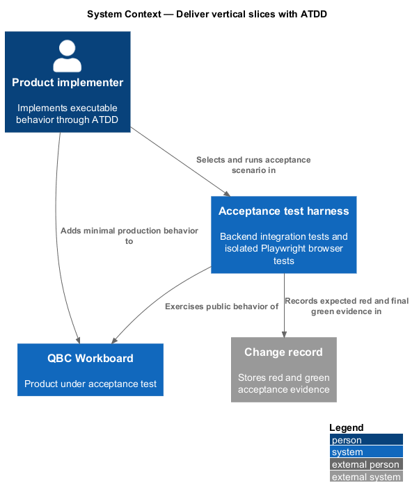
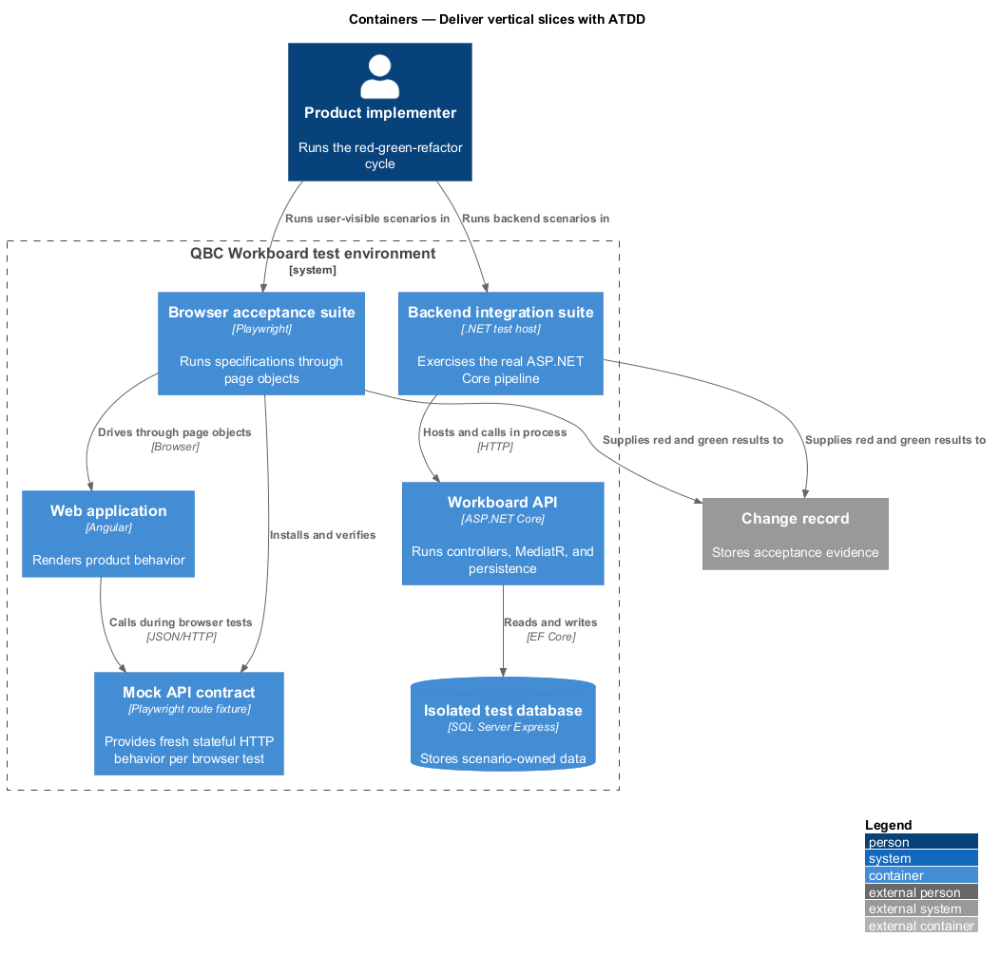
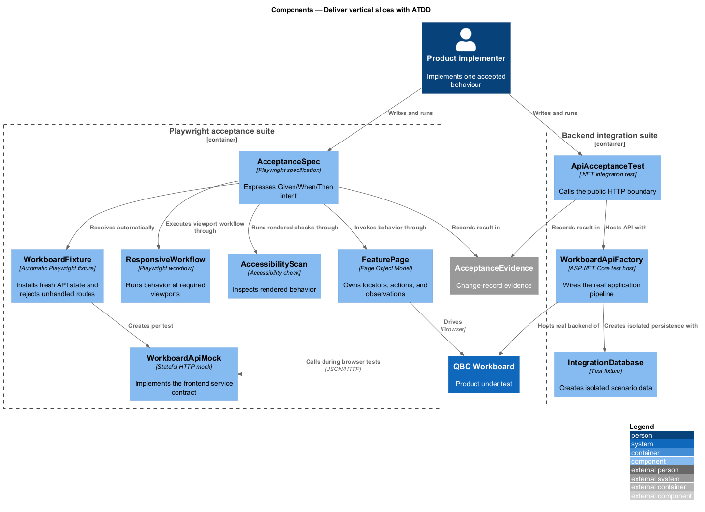
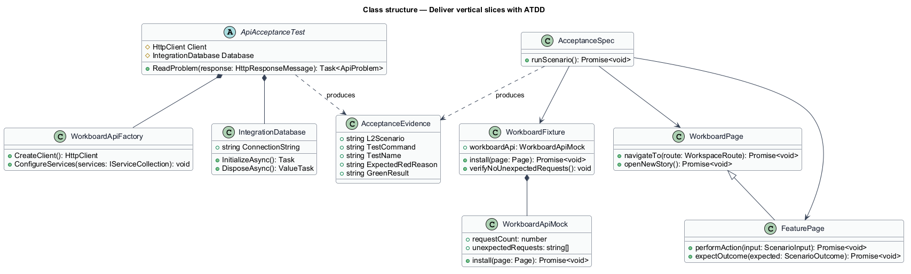
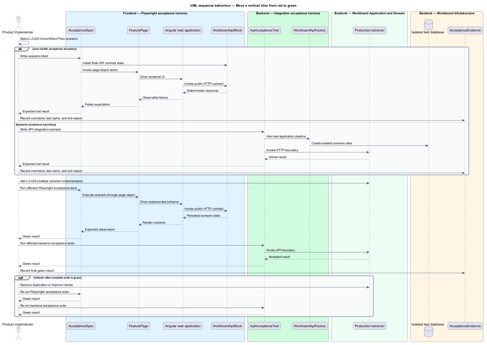

# Deliver vertical slices with ATDD

## Overview

Acceptance test-driven development (ATDD) defines the delivery sequence for all
executable product behavior and logic. Each vertical slice begins with one
Given/When/Then scenario expressed at a public acceptance boundary.

*red state* — acceptance test failure caused by the absent or incorrect product
behavior named by the selected scenario

*green state* — passing new acceptance test with all previously passing tests
still passing

*acceptance boundary* — backend integration test through the ASP.NET Core host or
frontend Playwright test through the rendered application and mocked HTTP contract

*Page Object Model* — Playwright structure in which page objects own selectors,
actions, and observations while specifications express scenario intent

The implementation records the expected red result, adds the smallest coherent
production change, and retains the green test as regression coverage. Supporting
unit or component tests may clarify isolated logic after the acceptance boundary
exists. Source-organization constraints use review and build evidence instead of
product tests.

## Description

The quality slice defines two acceptance harnesses and one delivery record.

- **`WorkboardApiFactory`** — ASP.NET Core integration-test host that wires real
  controllers, MediatR behaviors, handlers, and an isolated SQL Express database.
- **`IntegrationDatabase`** — per-test database scope that applies migrations,
  seeds scenario-owned data, and disposes after the test.
- **`ApiAcceptanceTest`** — base fixture for typed HTTP requests and Problem
  Details assertions.
- **`WorkboardApiMock`** — stateful in-memory implementation of every frontend
  HTTP service route, including Problem Details and sprint transition behavior.
- **`WorkboardFixture`** — automatic per-test Playwright fixture that installs the
  mock, supplies fresh state, and fails on an unhandled `/api` request.
- **`WorkboardPage`** — top-level Playwright page object for navigation and global
  actions.
- **`BoardPage`**, **`BacklogPage`**, **`HierarchyPage`**, and
  **`AssistantsPage`** — feature page objects that own locators, actions, and
  observations.
- **`AcceptanceSpec`** — Playwright specification that calls page-object methods
  and contains no raw selectors or `page.evaluate` calls.
- **`AcceptanceEvidence`** — change-record entry containing the L2 scenario, test
  command, test name, expected red reason, and final green result.
- **`AccessibilityScan`** — rendered-page check for critical and serious
  accessibility violations.
- **`ResponsiveWorkflow`** — Page Object Model workflow executed at 320, 390,
  768, 1024, and 1440 CSS-pixel viewport widths.

Backend acceptance tests select the real API boundary for backend-owned rules.
Playwright acceptance tests select the browser boundary for user-visible
behavior and replace the remote API with the stateful contract mock. Both
harnesses create their own data and avoid execution-order dependencies; browser
tests require neither an ASP.NET Core process nor SQL persistence.

## Requirements

The feature realizes the following level-2 (L2) requirements. Each L2
requirement refines one level-1 (L1) requirement.

| L2 ID | Refines (L1) | Requirement |
|-------|--------------|-------------|
| `L2-035` | `L1-012` | Every change that implements or modifies executable product behavior or logic shall follow ATDD in a red–green–refactor sequence. Before production logic is written, the implementer shall select one corresponding Given/When/Then acceptance scenario and create either a backend integration test or a frontend Playwright end-to-end test that initially fails because the required behavior is absent or incorrect. |
| `L2-036` | `L1-012` | After an acceptance test has demonstrated the expected failure, the implementation shall add the smallest coherent production change that satisfies the selected acceptance scenario. Speculative capabilities, unrelated refactoring, and abstractions not required by the current acceptance test are prohibited. |
| `L2-037` | `L1-012` | When a backend integration test is selected as the ATDD acceptance boundary, it shall exercise the behavior through the ASP.NET Core application boundary and include the controller, MediatR pipeline and handler, validation, and persistence behavior relevant to the scenario. |
| `L2-038` | `L1-012` | When a frontend end-to-end test is selected as the ATDD acceptance boundary, it shall use Playwright against the running Angular application and an isolated, stateful mock of the public API contract. All Playwright tests shall use the Page Object Model. Backend behavior shall remain covered by backend integration tests through the real ASP.NET Core and persistence boundaries. |
| `L2-039` | `L1-012` | Automated acceptance, integration, end-to-end, unit, or component tests shall verify executable behavior and logic only. Tests whose purpose is to police code organization or other non-behavioral implementation constraints shall not be created. |
| `L2-040` | `L1-012` | Automated and manual release checks shall verify the supported responsive and accessibility behaviors. These checks shall exercise rendered user behavior rather than source-code organization. |

## Diagrams

### System context

The implementer uses the acceptance harnesses to drive QBC Workboard behavior.
The test boundary is either the product API or the rendered browser application.

### Containers

Backend integration tests host the API with isolated persistence. Playwright tests
drive the Angular application while a per-test fixture implements its public HTTP
contract in memory.

### Components

The test harnesses, page objects, and evidence record establish the red state.
The same acceptance test verifies the minimal green implementation.

### Class structure

The class model separates test specifications from page selectors, composes the
browser fixture with a stateful API mock, and composes the backend fixture from
the real product pipeline.

### Behaviour — move a vertical slice from red to green

The sequence records scenario selection, the expected initial failure, the
minimal implementation, and the passing regression suite.

