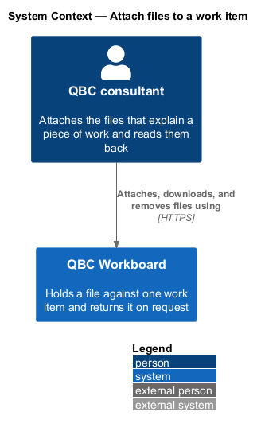
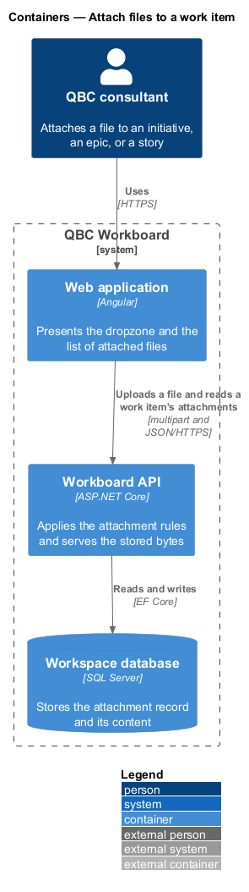
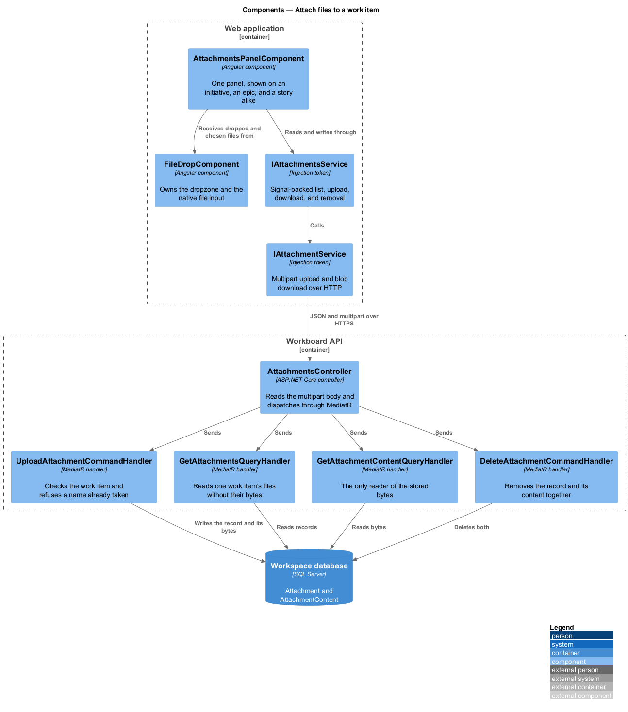
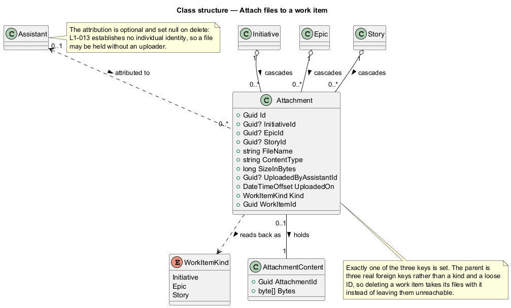
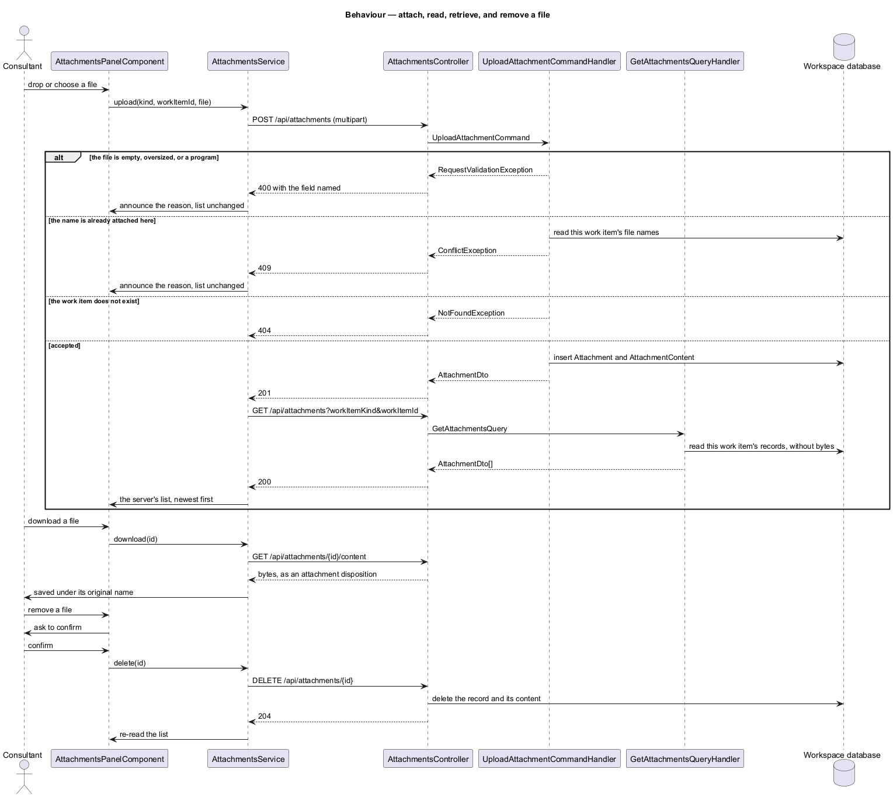

# Attach files to a work item

## Overview

A work item is described in prose: an initiative carries an outcome brief, an
epic a summary, a story its acceptance criteria. The brief that was actually
circulated, the diagram the design was agreed from, and the export the estimate
came out of are none of those things, and until now the workspace had nowhere to
put them.

*attachment* — one file held against one work item, with its name, its type, its
size, and the moment it arrived

*work item* — an initiative, an epic, or a story; the three levels a file can be
attached to

*uploader* — the assistant an attachment is attributed to, when one was named at
the time it was attached

This feature owns the attachment record, the stored bytes, the rules that accept
or refuse a file, the retrieval that hands it back, and the panel that reads them
on a work item. It does not introduce identity: the uploader is chosen when the
file is attached, because `L1-013` establishes no individual identity to infer,
and a file attached without one is held rather than refused.

## Description

The feature crosses one panel shown on three work-item surfaces, a file input the
application cannot declare for itself, an API controller, four handlers, two
domain entities, and persistence.

- **`AttachmentsPanelComponent`** — Angular panel listing a work item's files and
  offering the dropzone, the download, and the removal. It takes the work item it
  is reading as an input rather than routing to a page of its own, so an
  initiative, an epic, and a story all present the same list.
- **`FileDropComponent`** — `@qbc/components` control owning the dashed dropzone
  and the native file input. A file input cannot live in an application template,
  so it lives in the library; the input stays real and in the light DOM, and the
  keyboard, the file dialog, and the browser's own drop handling all work as they
  already do.
- **`IAttachmentsService`** — token-backed contract exposing the list as a Signal
  and the upload, download, and removal as Promises.
- **`AttachmentsService`** — implementation that re-reads the list after every
  write, so the panel never holds an opinion about the files that the server has
  not confirmed.
- **`IAttachmentService`** — token-backed contract for the attachment resource,
  and the one place in `@qbc/api` that sends something other than JSON.
- **`AttachmentsController`** — ASP.NET Core controller reading the multipart
  body, bounded by a transport ceiling set above the per-file limit.
- **`UploadAttachmentCommand`** — carries its own validation: the empty file, the
  file over 25 MB, and the extension that names a program are all refused before
  a handler sees them.
- **`UploadAttachmentCommandHandler`** — checks that the named work item exists
  and that the name is not already taken on it, then writes the record and its
  bytes together.
- **`GetAttachmentsQueryHandler`** — reads one work item's files, naming a single
  column so nothing is inherited from a parent work item or contributed to one.
- **`GetAttachmentContentQueryHandler`** — the only reader that touches the
  stored bytes.
- **`Attachment`** — entity holding the file's identity and its parent.
- **`AttachmentContent`** — the bytes, in their own record.

The parent is three nullable foreign keys rather than a kind and a loose ID, so
the database owns the relationship: deleting a work item takes its files with it
instead of leaving rows nothing can reach. Three cascades to one table would
usually be the point at which SQL Server refuses, but an epic restricts upward to
its initiative and a story to its epic, so these are three independent single-hop
cascades and no second path to the same table exists.

The bytes are kept in a second table so that listing a work item's files never
reads them, and they are kept in the workspace database rather than on disk or in
a storage account because the deployment has exactly one durable store; App
Service replaces its filesystem on every release, which would quietly lose every
attachment the product had.

A duplicate name is refused in the handler rather than in the command's own
validation, because it is the only one of the four refusals that has to ask the
database a question. It answers `409` where the other three answer `400`.

Newest-first ordering is applied once the rows are read rather than in the query.
The acceptance suite runs on SQLite, which cannot order by a `DateTimeOffset`,
and one work item's files are few enough that ordering them in memory costs
nothing.

## Requirements

The feature realizes the following level-2 (L2) requirements. Each L2
requirement refines one level-1 (L1) requirement.

| L2 ID | Refines (L1) | Requirement |
|-------|--------------|-------------|
| `L2-052` | `L1-016` | An attachment shall contain an ID, the single work item it belongs to, a file name, a content type, a size in bytes, the moment it was attached, the stored content of the file, and optionally the assistant it is attributed to. A work item shall hold its own attachments alone; no attachment shall be inherited from a parent work item or contributed to one. |
| `L2-053` | `L1-016` | An initiative, an epic, and a story shall each present the files attached to it and shall let a user attach a file by dropping it on the work item or by choosing it from their computer, retrieve an attached file, and remove one. |

## Diagrams

### System context

The consultant attaches the files that explain a piece of work, and reads them
back from the work item they belong to.

### Containers

The Angular application sends the file as multipart and reads one work item's
attachments as JSON. The API stores the record and its bytes in the workspace
database.

### Components

The panel takes files from `FileDropComponent` and reads and writes through
`IAttachmentsService`, which calls `IAttachmentService`. The controller dispatches
to four handlers, only one of which reads the stored bytes.

### Class structure

`Attachment` names its parent through three nullable keys, exactly one of which
is set, and holds its bytes in `AttachmentContent`. Deleting a work item cascades
to its files; deleting an assistant sets the attribution null and leaves the file
where it is.

### Behaviour — attach, read, retrieve, and remove a file

The sequence covers attaching a file, the list that is re-read after it, the
retrieval that returns the stored bytes, and the confirmed removal. Alternate
branches carry each of the four refusals and the unknown work item.

