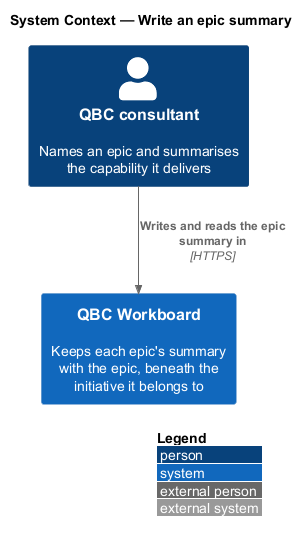
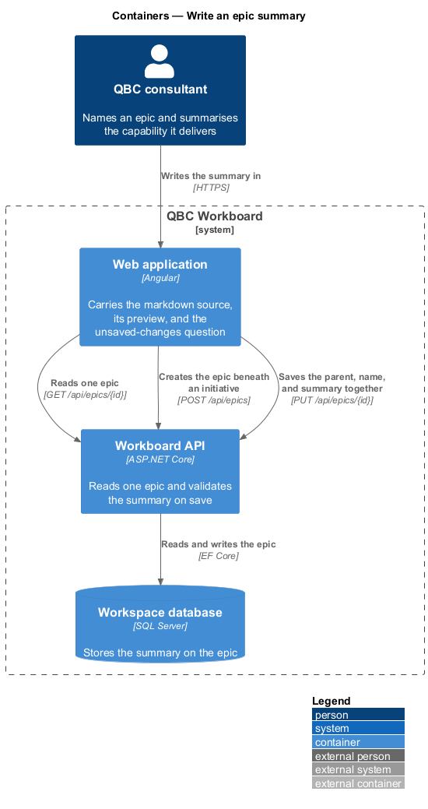
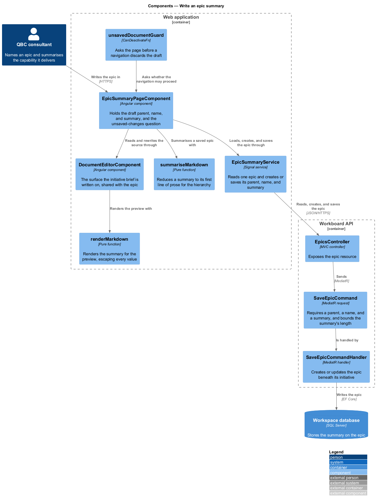
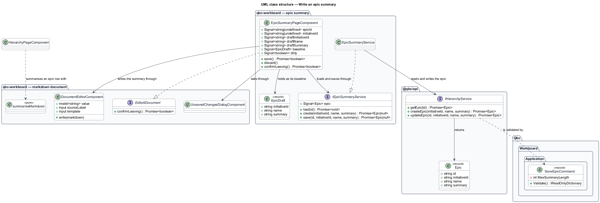
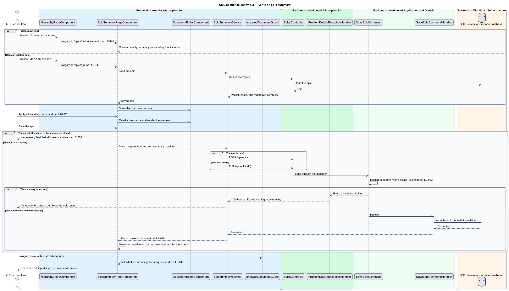

# Write an epic summary

## Overview

An epic names a slice of an initiative, and its summary says what that slice delivers. A
single line of text is enough to label a capability and not enough to draw a boundary
around one, so the summary is a markdown document and an epic is written on a route of its
own, where scope, what is deliberately out of scope, and the stories it expects can sit
beside the sentence that names it.

The parent initiative, the name, and the summary are the whole of an epic and are saved as
one record, so one surface writes all three. That surface both creates an epic and edits an
existing one; there is no second, plainer form beside the hierarchy, because a summary
written in a plain field would flatten the markdown it is made of.

An epic is written on the same editor an initiative is. This feature owns the epic's half
of that arrangement; [Edit the initiative brief](../edit-initiative-brief/) owns the
initiative's, and the surface they share lives under `features/markdown-document/`.

*epic summary* — the epic's description, written and read as a markdown document

*parent initiative* — the one initiative an epic belongs to, which it can be moved between

*unsaved-changes guard* — the question raised before a navigation would discard markdown
that has not been saved

The summary is the epic's own column rather than a record of its own, so saving one is an
ordinary epic create or update and every projection that names the epic sees the change.
The column already stores an unbounded string, so the document needed no schema change; the
API bounds its length instead, at the same 100,000 characters an initiative brief is bounded
at.

An epic moves between initiatives, so its parent is a field on the editor rather than part
of its address: `/epics/{epicId}` stays correct after a move. A new epic is started from an
initiative, which carries that initiative in `/epics/new?initiativeId=…` so the parent
arrives already chosen.

Nothing about the summary is written to browser storage. A draft lives in the page's signals
for as long as the page does, which keeps the workspace's single stored value the session
credential required by `L2-021`.

## Description

- **`EpicSummaryPageComponent`** — the routed page carrying the parent select, the name
  field, and the unsaved-changes question. Reached with an epic's ID to edit one and without
  it to create one; its `baseline` signal holds the epic as last saved, which unsaved
  changes are measured against. An epic has no house shape, so a new summary starts empty
  and the editor's empty state offers nothing to insert.
- **`EpicDraft`** — the parent, name, and summary the editor holds and saves as one record.
- **`EpicSummaryService`** and **`IEpicSummaryService`** — token-backed contract and Signal
  implementation that reads one epic and creates or saves its parent, name, and summary
  together, answering with the stored epic or with null when a save was refused.
- **`DocumentEditorComponent`**, **`MarkdownEditorComponent`**, **`renderMarkdown`**,
  **`MARKDOWN_COMMANDS`**, **`UnsavedChangesDialogComponent`**, and
  **`unsavedDocumentGuard`** — the shared editor, described in
  [Edit the initiative brief](../edit-initiative-brief/). The epic passes no `template` and
  its own `sourceLabel`, so a screen reader says which document is being written.
- **`summariseMarkdown`** — an epic summary's first line of prose, which `qbc-epic-row`
  carries where there is room for one line rather than for a markdown document.
- **`HierarchyService.getEpic`**, **`createEpic`**, and **`updateEpic`** — read and write one
  epic through the documented API. `GET /api/epics/{id}` already existed; the frontend client
  gained the reader an addressable route needs, because `EpicHierarchy` carries no parent
  reference and so cannot answer for an epic reached by its ID alone.
- **`SaveEpicCommand`** — requires a parent, a name, and a summary, and bounds the summary at
  100,000 characters, reporting the refusal against the `summary` field.

## Requirements

The feature realizes the following level-2 (L2) requirements. Each L2 requirement refines one
level-1 (L1) requirement.

| L2 ID | Refines (L1) | Requirement |
|-------|--------------|-------------|
| `L2-003` | `L1-002` | An epic shall contain an ID, name, summary, and one initiative reference. The summary shall be markdown, and the application shall offer no other way to write it. The user shall be able to create, view, update, move, and delete epics. |
| `L2-049` | `L1-002` | An epic's summary shall be authored and read as a markdown document on its own addressable route. The same route shall create an epic and edit an existing one. The application shall present the parent initiative, the name, and the summary for one epic, shall save them together, and shall preserve the summary's markdown structure. A summary shall remain required, and the API shall reject a summary longer than the supported length. |

The authoring aids and the unsaved-changes question the editor provides are `L2-047` and
`L2-048`, which describe the shared editor and so cover both records.

## Diagrams

### System context

A consultant names an epic and summarises the capability it delivers, and the workspace keeps
that summary with the epic it belongs to.

### Containers

The Angular application reads one epic and creates or saves the edited parent, name, and
summary through the same epic resource the hierarchy uses.

### Components

The page drives the shared document editor, renders the summary for the preview, and asks the
unsaved-changes question before a navigation proceeds.

### Class structure

The class model separates the epic the page holds from the editor that carries its markdown,
so the surface an initiative is written on serves an epic unchanged.

### Behaviour — write an epic summary

The sequence follows an epic from creating or opening it, through formatting and preview, to
saving, and covers the unsaved-changes question raised when a navigation would discard the
draft.

