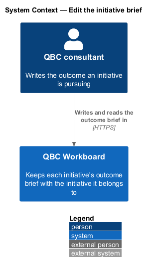
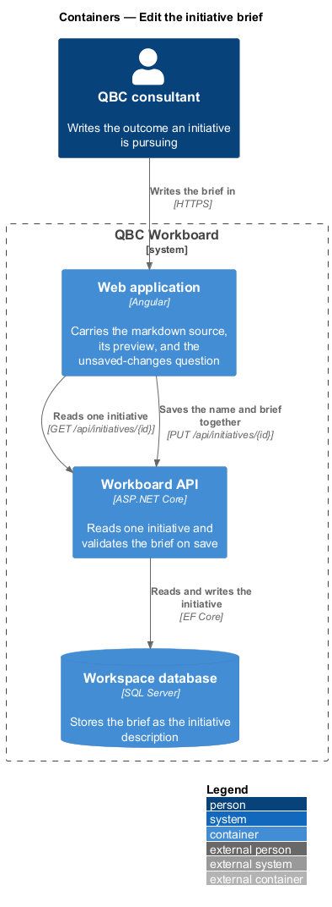
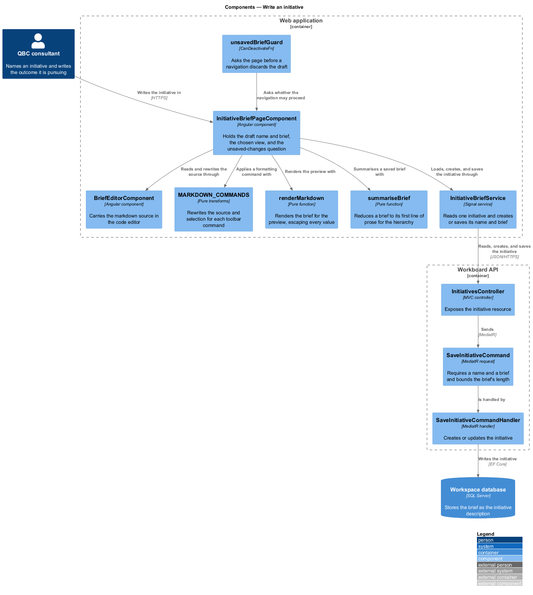
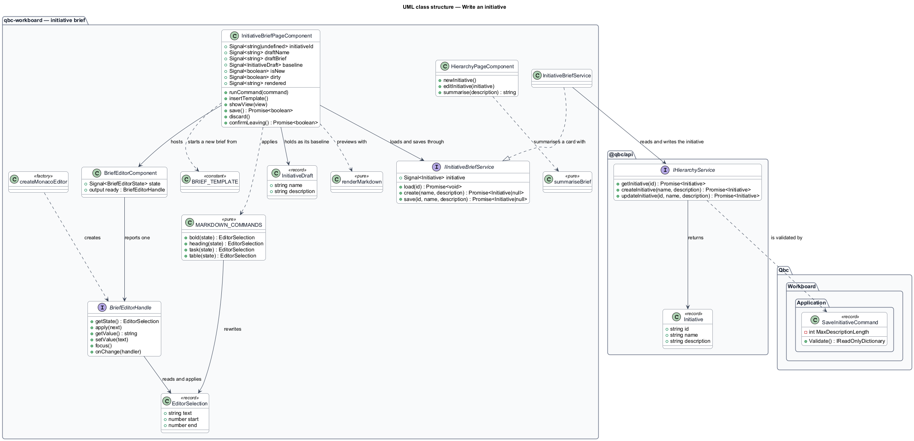
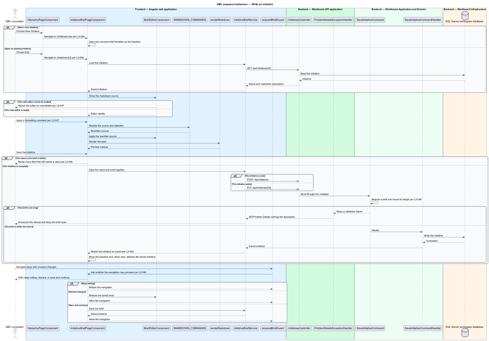

# Edit the initiative brief

## Overview

An initiative's description carries the outcome the organization is pursuing. A single line of
text is enough to name an outcome and not enough to argue for one, so the description is a
markdown document and an initiative is written on a route of its own, where an outcome can
carry success signals, guardrails, and planned epics beside the sentence that names it.

The name and the brief are the whole of an initiative and are saved as one record, so one
surface writes both. That surface both creates an initiative and edits an existing one; there
is no second, plainer form beside the hierarchy, because a description written in a plain field
would flatten the markdown the brief is made of.

*outcome brief* — the initiative description, written and read as a markdown document

*editor handle* — what the page needs from the control carrying the markdown, which keeps the
code editor's own types inside the editor folder

*unsaved-changes guard* — the question raised before a navigation would discard markdown that
has not been saved

The brief is the initiative's description rather than a record of its own, so saving one is an
ordinary initiative create or update and every projection that names the initiative sees the
change. The description column already stores an unbounded string, so the document needed no
schema change; the API bounds its length instead.

A brief is markdown whichever control carries it, so there is no plainer editor to fall back to.
An editor that cannot be loaded is reported as unavailable rather than replaced by a surface
that would present the same document less well.

Nothing about the brief is written to browser storage. A draft lives in the page's signals for
as long as the page does, which keeps the workspace's single stored value the session credential
required by `L2-021`.

## Description

- **`InitiativeBriefPageComponent`** — the routed page carrying the name field, the markdown
  toolbar, the write, split, and preview views, the size report, and the unsaved-changes
  question. It is reached with an initiative's ID to edit one and without it to create one. Its
  `baseline` signal holds the initiative as last saved, which unsaved changes are measured
  against and which a new initiative starts from as the outcome template.
- **`InitiativeDraft`** — the name and description the editor holds and saves as one record.
- **`InitiativeBriefService`** and **`IInitiativeBriefService`** — token-backed contract and
  Signal implementation that reads one initiative and creates or saves its name and brief
  together, answering with the stored initiative or with null when a save was refused.
- **`unsavedBriefGuard`** — `CanDeactivateFn` that asks the page whether a navigation away may
  proceed. It guards the create route as well as an identified initiative.
- **`BriefEditorComponent`** — hosts the markdown source in the code editor and reports a
  `BriefEditorState` of loading, ready, or failed.
- **`BriefEditorHandle`** — what the page needs from that editor: source, selection, focus,
  change notification, and layout.
- **`createMonacoEditor`** — the one implementation, imported only when the route is opened.
- **`briefEditorWorker`** — the worker entry that lets the application bundler own and emit the
  code editor's background worker.
- **`renderMarkdown`** — escape-first renderer for the block and inline markdown a brief uses.
- **`summariseBrief`** — a brief's first line of prose, which the hierarchy card carries where
  there is room for one line rather than for a markdown document.
- **`MARKDOWN_COMMANDS`** and **`insertBlock`** — pure transforms over the source and its
  selection, which the toolbar runs against the editor handle.
- **`BRIEF_TEMPLATE`** — the house shape of an outcome brief, which a new initiative opens from
  and an emptied brief offers back.
- **`SegmentedComponent`** — `@qbc/components` control presenting the write, split, and preview
  choice with `aria-pressed`; `Alt+1`, `Alt+2`, and `Alt+3` reach the same three views.
- **`HierarchyService.getInitiative`**, **`createInitiative`**, and **`updateInitiative`** — read
  and write one initiative through the documented API.
- **`SaveInitiativeCommand`** — bounds the description at 100,000 characters and reports the
  refusal against the `description` field.

The renderer escapes every value before it reaches the output and admits only http, mail,
in-page, and repository-relative link targets. The template binds its result through
`innerHTML`, so the framework sanitizes the same markup a second time.

## Requirements

The feature realizes the following level-2 (L2) requirements. Each L2 requirement refines one
level-1 (L1) requirement.

| L2 ID | Refines (L1) | Requirement |
|-------|--------------|-------------|
| `L2-046` | `L1-002` | An initiative's description shall be authored and read as a markdown outcome brief on its own addressable route. The same route shall create an initiative and edit an existing one. The application shall present the name and the brief for one initiative, shall save them together, and shall preserve the brief's markdown structure. A brief shall remain required, and the API shall reject a brief longer than the supported length. |
| `L2-047` | `L1-002` | The brief editor shall provide markdown authoring aids: formatting commands that act on the current selection, a rendered preview of the brief, and a report of its size. It shall present the markdown source in a code editor and shall report when that editor cannot be loaded. |
| `L2-048` | `L1-002` | The brief editor shall report whether the brief holds unsaved changes, shall let the user discard them, and shall not allow a navigation away from the brief to discard them silently. Unsaved brief content shall be held in memory for the life of the page and shall not be written to browser storage. |

## Diagrams

### System context

A consultant names an initiative and writes the outcome it is pursuing, and the workspace keeps
that brief with the initiative it belongs to.

### Containers

The Angular application reads one initiative and creates or saves the edited name and brief
through the same initiative resource the hierarchy uses.

### Components

The page drives the editor handle through pure markdown transforms, renders the brief for the
preview, and asks the unsaved-changes question before a navigation proceeds.

### Class structure

The class model separates the markdown transforms from the editor that carries the source, so
the toolbar, the preview, and the size report are written against the document rather than
against the editor.

### Behaviour — write an initiative

The sequence follows an initiative from creating or opening it, through formatting and preview,
to saving, and covers the unsaved-changes question raised when a navigation would discard the
draft.

