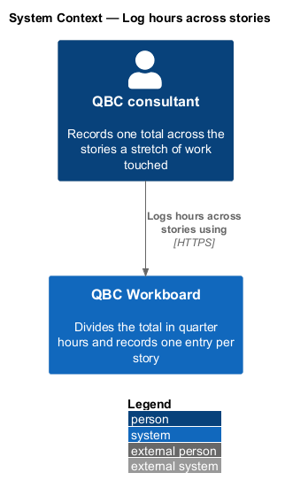
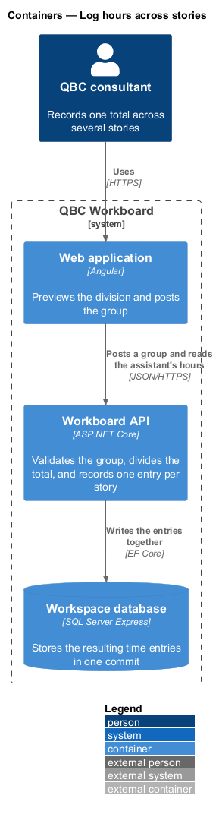
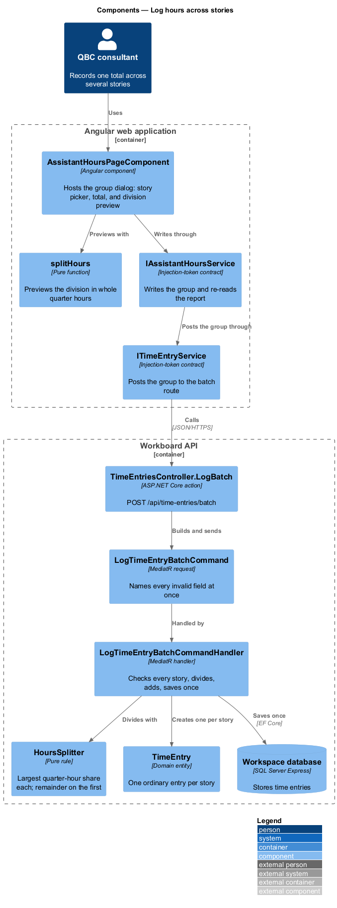
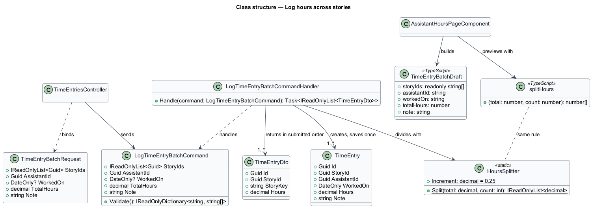
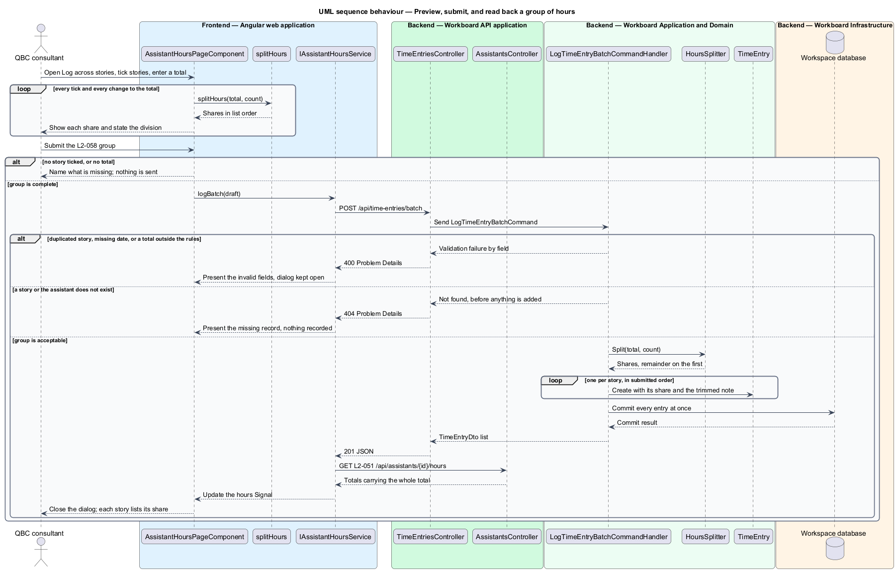

# Log hours across stories

## Overview

A group time entry records one total an assistant spent across several stories
in a single submission. A morning spread over three stories is one number in the
assistant's head, not three; asking for three entries invites rounding each one
and losing the total. The group takes the total once and divides it.

*group time entry* — one assistant, one date, one total, one optional note, and
an ordered list of stories the total is divided across

*share* — the hours one story receives: the largest quarter-hour amount that
fits on every story, with the remainder placed on the first story chosen

*first story* — the story at the head of the submitted order, which is the order
the picker lists them in, so the reader can see which one will carry the
remainder before submitting

This feature owns the division rule, the request that carries a group, the
handler that records it as ordinary entries, and the dialog that previews the
division. It introduces no new record: once persisted, each share is a time
entry under [Log hours against a story](../log-hours-against-a-story/README.md),
read, amended, and removed exactly as one logged alone. The group has no
identity of its own.

## Description

The feature crosses the assistant's hours page, a second dialog beside the
single-entry one, a route on the existing entry controller, a handler, and a
pure division rule shared in spirit by the frontend preview.

- **`AssistantHoursPageComponent`** — the same page hosts the **Log across
  stories** action and its dialog: a checkbox list of every non-archived story,
  the date, the total, the note, the share beside each ticked story, and a
  status line stating the division in words.
- **`IAssistantHoursService`** — gains `logBatch`, which writes the group and
  re-reads the report, exactly as `log` does.
- **`ITimeEntryService`** — gains `logBatch`, posting the group to the batch
  route and returning the entries it produced.
- **`splitHours`** — the division rule in `@qbc/api`, computed in whole quarter
  hours so floating-point arithmetic cannot preview a share the API would
  refuse.
- **`TimeEntriesController.LogBatch`** — `POST /api/time-entries/batch`, beside
  the single-entry `POST` rather than overloading it, answering `201` with the
  entries in submitted order.
- **`LogTimeEntryBatchCommand`** — carries the story IDs, assistant, date,
  total, and note, and names every invalid field at once: an empty or
  duplicated story list, a missing assistant or date, and a total outside the
  single-entry rules or too small to give every story a quarter hour.
- **`LogTimeEntryBatchCommandHandler`** — checks every story and the assistant
  exist before adding anything, divides the total, adds one `TimeEntry` per
  story, and saves once, so the group is persisted whole or not at all.
- **`HoursSplitter`** — the division rule, pure and unit-tested on its own:
  `base = floor((total ÷ N) ÷ 0.25) × 0.25`; every story but the first receives
  `base`; the first receives `total − base × (N − 1)`.

The division favours the first story rather than spreading the remainder,
because a remainder spread one quarter hour at a time would make the shares
depend on how many stories were chosen in a way no reader could predict. One
rule, one story, and the preview shows exactly what the API will record.

## Requirements

The feature realizes the following level-2 (L2) requirements. Each L2
requirement refines one level-1 (L1) requirement.

| L2 ID | Refines (L1) | Requirement |
|-------|--------------|-------------|
| `L2-058` | `L1-019` | A group time entry shall name an assistant, a date worked, an ordered list of one or more distinct stories, one total amount of hours, and an optional note, and shall be recorded as one ordinary time entry (`L2-050`) per story. The total shall be positive, no more than 24, a quarter-hour increment, and at least a quarter hour per story, and shall be divided with the remainder on the first story. The entries shall be persisted together or not at all. |

## Diagrams

### System context

The consultant records one total across the stories a stretch of work touched.

### Containers

The Angular application previews the division and posts the group to the API,
which records one entry per story in a single commit.

### Components

The hours page consumes `IAssistantHoursService`, which writes the group through
`ITimeEntryService`. The controller dispatches to a handler that applies
`HoursSplitter` and persists the entries together.

### Class structure

`LogTimeEntryBatchCommand` produces ordinary `TimeEntry` records through
`HoursSplitter`; nothing new is stored.

### Behaviour — log hours across stories

The sequence covers previewing the division, submitting the group, and reading
the report it changes. Alternate branches carry the refusal of an invalid group
and the unknown story that leaves the whole group unrecorded.

