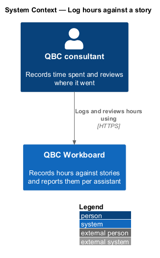
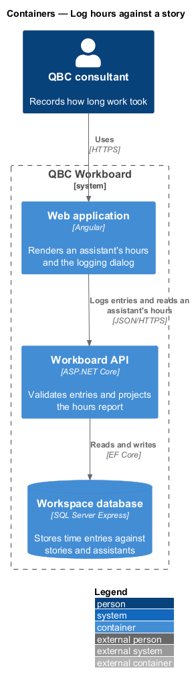
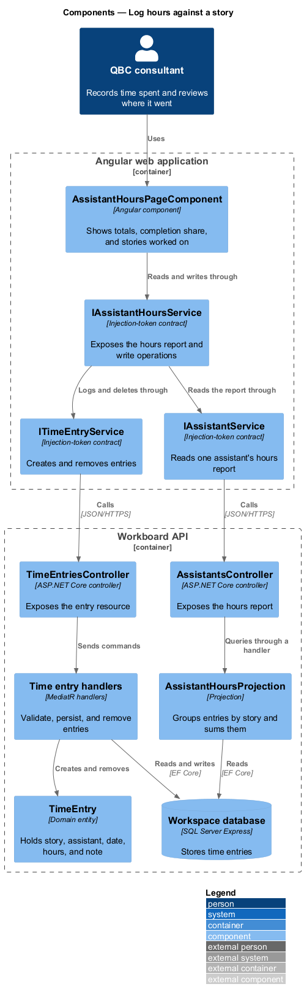
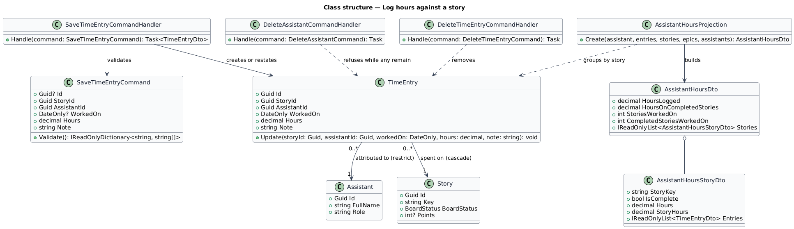
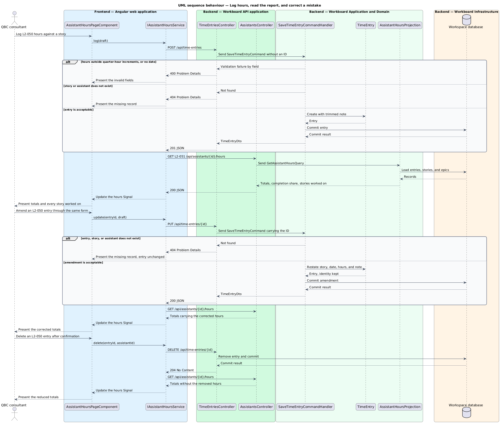

# Log hours against a story

## Overview

A time entry records how long an assistant spent on a story. The workspace
estimates a story in points and marks completion with a board column; neither
says how long the work took, so the entry is the only record of effort actually
spent.

*time entry* — one assistant's hours on one story on one date, with an optional
note

*worked on* — relationship established by having hours logged against a story,
independent of who owns the story now

*hours on completed stories* — the share of an assistant's logged time that sits
on stories whose board status is Done at the moment the page is read

This feature owns the entry record, the rules that accept or refuse one, the
amendment and the removal that correct a mistake, and the per-assistant report
that reads them back. It does not introduce identity: the assistant an entry is
attributed to is chosen on the form, because `L1-013` establishes no individual
identity to infer.

## Description

The feature crosses an assistant's hours page, a logging dialog, an API
controller, handlers, a domain entity, and persistence.

- **`AssistantHoursPageComponent`** — Angular page for one assistant's totals,
  completion share, story list, filter, disclosure, and logging dialog. The same
  dialog records a new entry and corrects an existing one, opened on what was
  recorded.
- **`IAssistantHoursService`** — token-backed contract exposing the hours report
  and the log, update, and delete operations as Signals.
- **`AssistantHoursService`** — implementation that reads the report after every
  write, so the page never keeps its own opinion of the totals.
- **`ITimeEntryService`** — token-backed contract for the entry resource.
- **`TimeEntriesController`** — ASP.NET Core controller for creating, amending,
  and removing an entry.
- **`AssistantsController.GetHours`** — the report, hung off the assistant the
  hours belong to.
- **`SaveTimeEntryCommandHandler`** — MediatR handler that checks the story and
  the assistant exist and then persists a valid entry, creating one when the
  command carries no ID and restating the named one when it does.
- **`DeleteTimeEntryCommandHandler`** — unguarded removal; an entry corrects the
  record and nothing depends on it.
- **`DeleteAssistantCommandHandler`** — refuses an assistant whose hours are
  logged, alongside the assignments that already blocked deletion.
- **`TimeEntry`** — entity holding story, assistant, date, hours, and note, all
  of which an amendment restates: the entry was only ever a statement about which
  work the time went into, so correcting the story is as ordinary as correcting
  the amount.
- **`AssistantHoursProjection`** — groups entries by story, sums them in memory,
  and reports the assistant's own share apart from every hour on the story.

Hours are summed over loaded records rather than in the database, because the
acceptance suite stores a `decimal` as text and would sum it as text. Completion
is read at projection time rather than recorded on the entry, so moving a story
off Done moves its hours out of the completed total with it.

## Requirements

The feature realizes the following level-2 (L2) requirements. Each L2
requirement refines one level-1 (L1) requirement.

| L2 ID | Refines (L1) | Requirement |
|-------|--------------|-------------|
| `L2-050` | `L1-015` | A time entry shall contain an ID, the story the time was spent on, the assistant it is attributed to, the date worked, a positive number of hours in quarter-hour increments no greater than 24, and an optional note. |
| `L2-051` | `L1-015` | The workspace shall provide, for a single assistant, a page reporting the hours they logged, how much of that time is on stories that are now complete, and every story they worked on, where an assistant has worked on a story when they have hours logged against it. |

## Diagrams

### System context

The consultant records how long work took and reads back what an assistant spent
their time on.

### Containers

The Angular application posts entries to the API and reads one assistant's hours
report. The API commits entries to the workspace database.

### Components

The hours page consumes `IAssistantHoursService`, which reads the report through
`IAssistantService` and writes entries through `ITimeEntryService`. The
controllers dispatch to handlers that apply the rules and project the report.

### Class structure

`TimeEntry` references a story and an assistant without merging their lifecycles.
Deleting a story takes its entries with it; deleting an assistant is refused
while any of theirs remain.

### Behaviour — log and correct hours

The sequence covers logging an entry, reading the report it changes, amending one
in place, and removing one. Alternate branches carry the refusal of an invalid
amount and the refusal to delete an assistant whose hours are logged.

