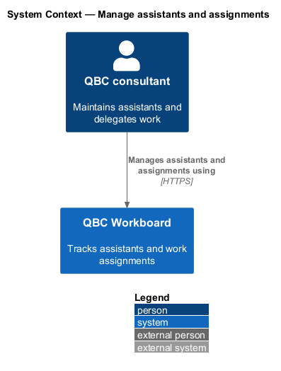
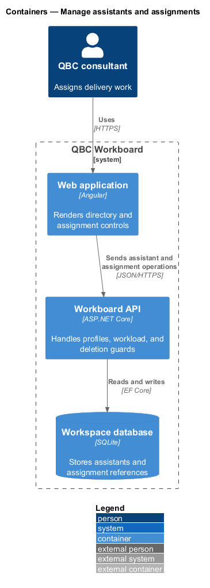
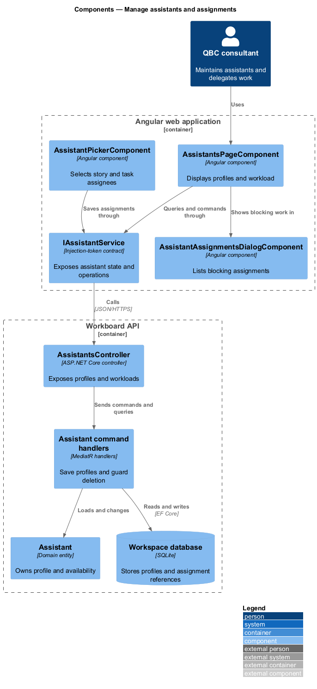
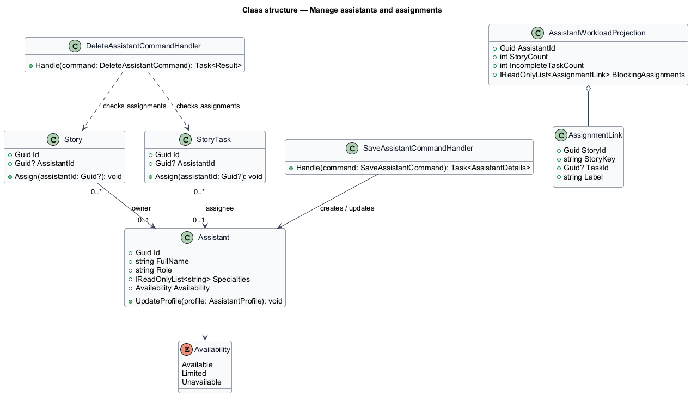
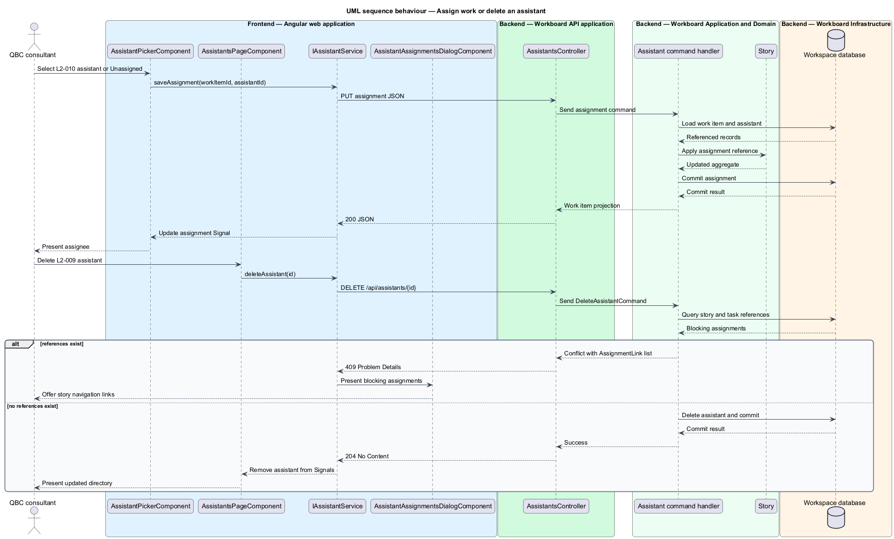

# Manage assistants and assignments

## Overview

An assistant represents a person or agent available to perform delivery work.
The assistant directory records each assistant's role, specialties, and current
availability. Stories and story tasks may each reference one assistant.

*assistant* — assignable delivery participant recorded in the workspace

*assignment* — optional reference from a story or task to one assistant

*availability* — Available, Limited, or Unavailable planning indicator

Assignment does not transfer ownership of a work item between records. Removing
an assignment leaves both the assistant and work item intact. Assistant deletion
is blocked until every story and task reference has been reassigned or removed.

## Description

The feature includes the assistant directory and assignment controls embedded in
story editing.

- **`AssistantsPageComponent`** — Angular route component that renders assistant
  identity, specialties, availability, and workload counts.
- **`AssistantFormComponent`** — external-template form for create and update
  operations.
- **`AssistantAssignmentsDialogComponent`** — blocking-work dialog that links to
  each story requiring reassignment.
- **`AssistantPickerComponent`** — shared unassigned-or-assistant selector used
  for stories and tasks.
- **`IAssistantService`** — token-backed contract for directory queries and
  assistant commands.
- **`AssistantService`** — HTTP implementation that owns assistant Signal state.
- **`AssistantsController`** — ASP.NET Core controller for assistant resources
  and assignment projections.
- **`SaveAssistantCommandHandler`** — MediatR handler for create and update
  operations.
- **`DeleteAssistantCommandHandler`** — handler that returns a conflict with the
  blocking assignments when references exist.
- **`Assistant`** — domain entity containing identity, profile, and availability.
- **`AssistantWorkloadProjection`** — query result containing non-archived story
  and incomplete task counts.

The story aggregate stores assignment references. The assistant query calculates
workload counts from current story and task state. The delete command returns
story-level navigation targets for every blocking assignment.

## Requirements

The feature realizes the following level-2 (L2) requirements. Each L2
requirement refines one level-1 (L1) requirement.

| L2 ID | Refines (L1) | Requirement |
|-------|--------------|-------------|
| `L2-009` | `L1-004` | An assistant shall contain an ID, full name, role, zero or more specialties, and an availability value of Available, Limited, or Unavailable. |
| `L2-010` | `L1-004` | Each story and each task may be unassigned or assigned to one existing assistant. |

## Diagrams

### System context

The consultant maintains assistants and assigns their work within QBC Workboard.

### Containers

The Angular directory and story forms call the API. The API validates assistant
references against persistent workspace data.

### Components

The assistant page and picker consume a contract-backed service. Backend handlers
save profiles, project workloads, and enforce deletion guards.

### Class structure

The model separates assistant profile data from optional story and task
references. The workload projection summarizes those references.

### Behaviour — assign work or delete an assistant

The sequence shows assignment persistence and the delete conflict that returns
navigable blocking work.

