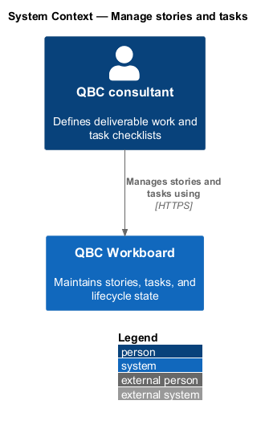
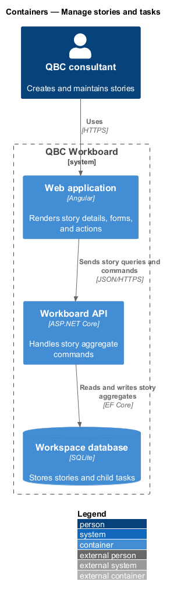
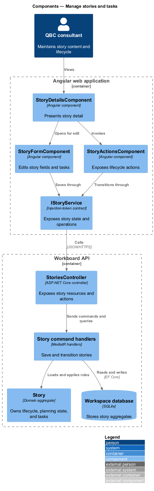
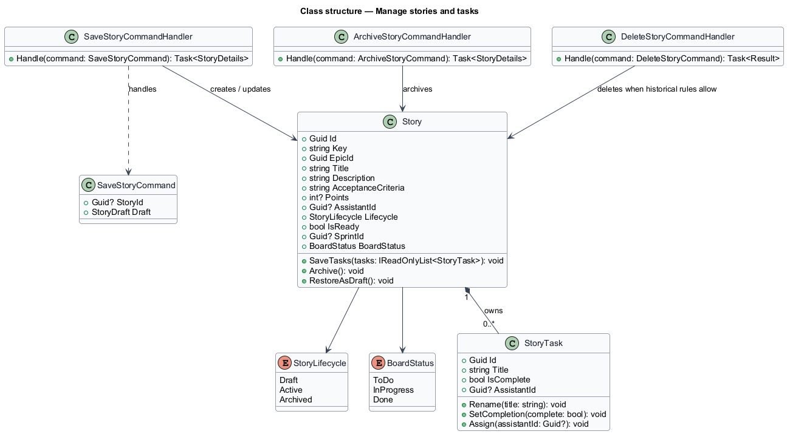
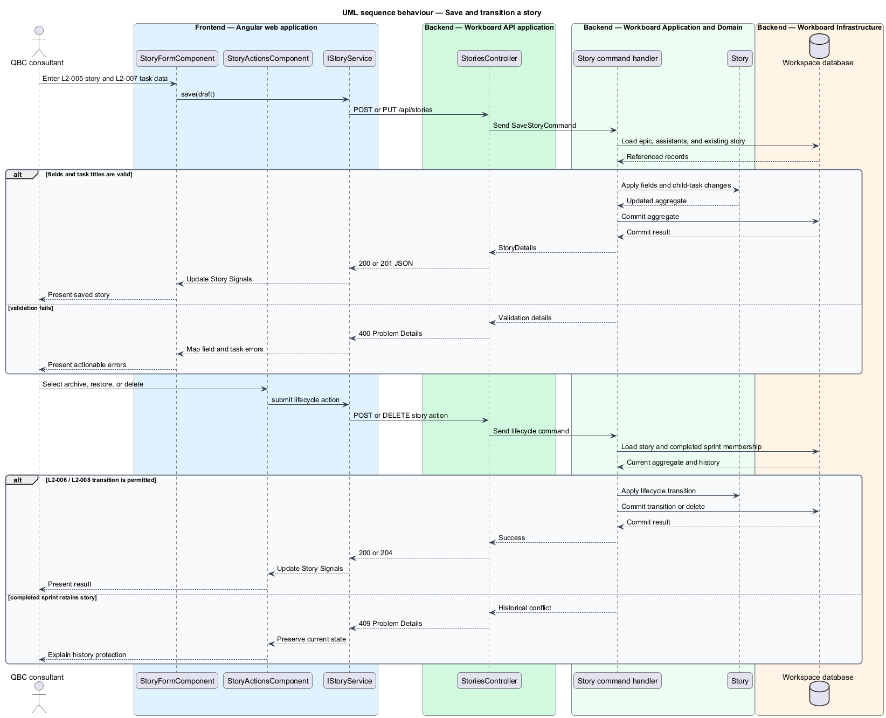

# Manage stories and tasks

## Overview

A story captures a small deliverable outcome. It belongs to one epic and carries
the information needed to discuss, estimate, plan, and complete the work. A task
is an optional checklist item owned by its parent story.

*story lifecycle* — Draft, Active, or Archived condition that controls how a
story participates in planning

*readiness* — independent indication that a non-archived story satisfies the
grooming rules

*story task* — lightweight checklist item with a title, completion state, and
optional assistant assignee

This feature owns story identity, editable content, lifecycle transitions, and
task composition. Archival retains work for later retrieval. Permanent deletion
removes a story only when completed sprint history does not retain it.

## Description

The feature crosses story forms, lifecycle actions, API controllers, handlers,
domain rules, and persistence.

- **`StoryFormComponent`** — Angular form for story content, estimate, owner,
  lifecycle, and task editing.
- **`StoryDetailsComponent`** — read projection shared by board, backlog,
  hierarchy, and assistant assignment entry points.
- **`StoryActionsComponent`** — progressive-disclosure menu for archive, restore,
  and permanent deletion.
- **`IStoryService`** — token-backed contract for story queries, saves, and
  lifecycle commands.
- **`StoryService`** — HTTP implementation that exposes story state as Signals.
- **`StoriesController`** — ASP.NET Core controller for story resources and
  explicit lifecycle actions.
- **`SaveStoryCommandHandler`** — MediatR handler that assigns new story keys and
  persists valid edits.
- **`ArchiveStoryCommandHandler`**, **`RestoreStoryCommandHandler`**, and
  **`DeleteStoryCommandHandler`** — handlers for guarded lifecycle operations.
- **`Story`** — aggregate root that owns lifecycle, readiness, planning state,
  board state, and its task collection.
- **`StoryTask`** — child entity whose lifetime belongs to `Story`.
- **`StoryLifecycle`** and **`BoardStatus`** — enumerations that keep lifecycle
  and delivery workflow independent.

`Story` assigns a `QBC-{number}` key once and never changes it. The story
aggregate applies task additions, edits, completion, assignment, and removal in
the same transaction as the parent save.

## Requirements

The feature realizes the following level-2 (L2) requirements. Each L2
requirement refines one level-1 (L1) requirement.

| L2 ID | Refines (L1) | Requirement |
|-------|--------------|-------------|
| `L2-005` | `L1-003` | A story shall contain an ID, story key, epic reference, title, description or user-story statement, acceptance criteria, story-point estimate, optional assistant owner, lifecycle state, readiness, optional sprint reference, board status, and zero or more tasks. |
| `L2-006` | `L1-003` | Story lifecycle states shall be Draft, Active, and Archived. Readiness shall be maintained independently for non-archived stories. |
| `L2-007` | `L1-003` | A story may contain checklist tasks. Each task shall contain an ID, non-blank title, completion state, and optional assistant assignee. |
| `L2-008` | `L1-003` | The user shall be able to archive active work, restore archived work as a draft, and permanently delete a story after confirmation. |

## Diagrams

### System context

The consultant creates and maintains stories and their task checklists inside
QBC Workboard.

### Containers

The Angular application submits typed story commands to the API. The API commits
the story aggregate and child tasks to the workspace database.

### Components

The story components consume `IStoryService`. The controller dispatches commands
to handlers that apply rules on the `Story` aggregate.

### Class structure

The story aggregate composes task entities and references epic, assistant, and
sprint identities without merging their lifecycles.

### Behaviour — save and transition a story

The sequence covers story save and lifecycle actions. Alternate branches enforce
task validation and completed-sprint history protection.

