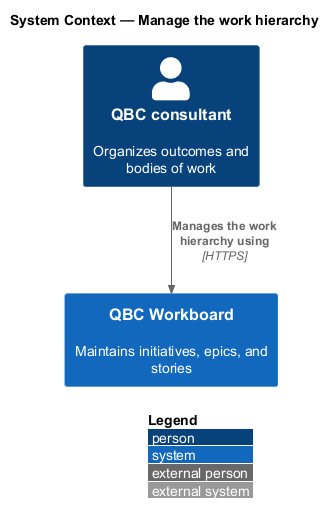
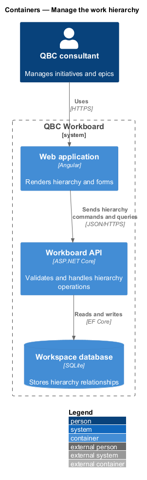
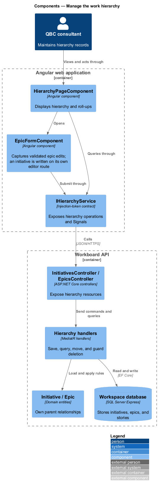
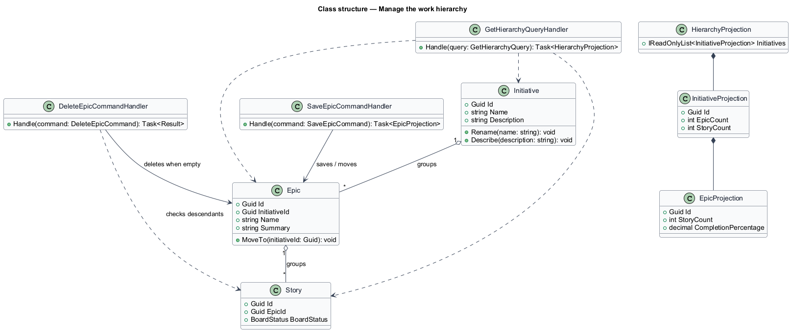
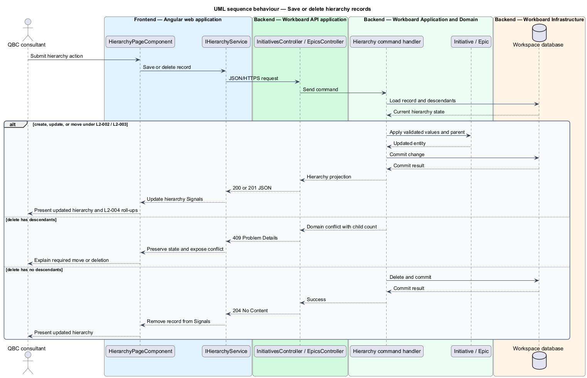

# Manage the work hierarchy

## Overview

The work hierarchy connects strategic outcomes to implementable work. An
initiative represents an outcome pursued by the organization. An epic represents
a substantial body of work within one initiative. A story represents a small
deliverable outcome within one epic.

*initiative* — outcome-oriented container for one or more epics

*epic* — body of related work assigned to exactly one initiative

*hierarchy roll-up* — count or completion measure calculated from descendant
records

This feature manages initiatives and epics while preserving the
Initiative → Epic → Story relationship. Guarded deletion prevents a parent from
disappearing while children still reference it.

## Description

The feature forms one vertical slice from the hierarchy page to durable data.

- **`HierarchyPageComponent`** — Angular route component that renders initiative
  cards, epic rows, counts, progress, and contextual creation actions. An
  initiative's own create and update actions open its editor route rather than a
  form here, because a name and a markdown brief are saved as one record; see
  [Edit the initiative brief](../edit-initiative-brief/).
- **`summariseBrief`** — reduces an initiative's markdown brief to its first line
  of prose, which is what a card has room to carry.
- **`EpicFormComponent`** — external-template form for epic create, update, and
  parent movement.
- **`IHierarchyService`** — token-backed frontend contract for hierarchy queries
  and commands.
- **`HierarchyService`** — HTTP implementation that updates Signal state from
  server responses.
- **`InitiativesController`** and **`EpicsController`** — controller boundaries
  for hierarchy resources.
- **`SaveInitiativeCommandHandler`** and **`SaveEpicCommandHandler`** — MediatR
  handlers for validated create and update operations.
- **`DeleteInitiativeCommandHandler`** and **`DeleteEpicCommandHandler`** —
  handlers that reject deletion when descendants exist.
- **`GetHierarchyQueryHandler`** — query handler that projects nested records,
  story counts, and epic completion percentages.
- **`Initiative`** and **`Epic`** — domain entities that hold identity and parent
  relationships.

The API returns `409 Conflict` when a requested deletion violates a hierarchy
constraint. Parent movement changes only the epic's initiative reference; it
does not change the story-to-epic relationship.

## Requirements

The feature realizes the following level-2 (L2) requirements. Each L2
requirement refines one level-1 (L1) requirement.

| L2 ID | Refines (L1) | Requirement |
|-------|--------------|-------------|
| `L2-002` | `L1-002` | An initiative shall contain an ID, name, and outcome-oriented description. The description shall be markdown, and the application shall offer no other way to write it. The user shall be able to create, view, update, and delete initiatives. |
| `L2-003` | `L1-002` | An epic shall contain an ID, name, summary, and one initiative reference. The user shall be able to create, view, update, move, and delete epics. |
| `L2-004` | `L1-002` | The hierarchy view shall present initiatives with their epics and enough roll-up information to understand the work beneath them. |

## Diagrams

### System context

The consultant manages the strategic work hierarchy through QBC Workboard. No
external system participates in this feature.

### Containers

The Angular application sends hierarchy commands and queries to the API. The API
stores parent and child relationships in the workspace database.

### Components

The hierarchy page calls a token-backed service. Controllers dispatch MediatR
requests to handlers that use the domain entities and database.

### Class structure

The class model shows hierarchy ownership, command handling, and the projection
returned to the Angular page.

### Behaviour — save or delete hierarchy records

The sequence covers validated create and update operations. Its alternate branch
shows deletion succeeding only when no descendants exist.

