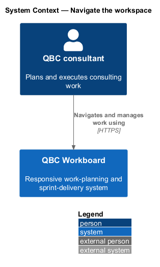
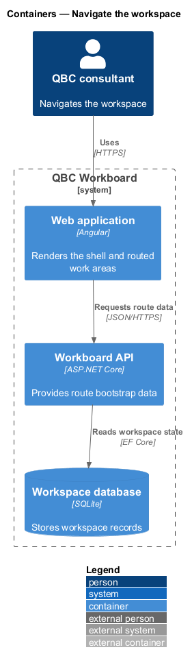
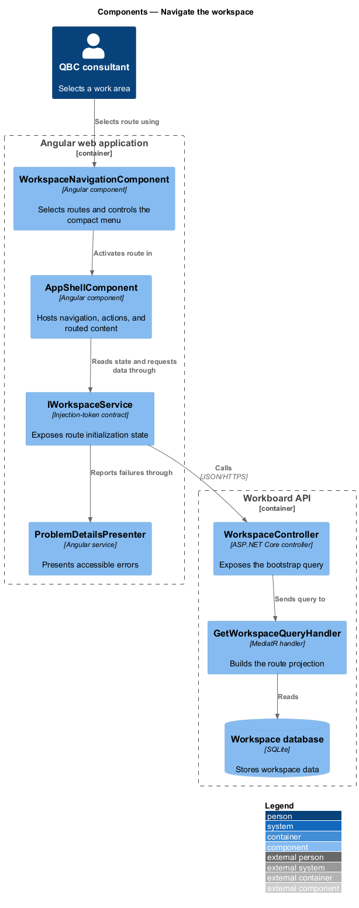
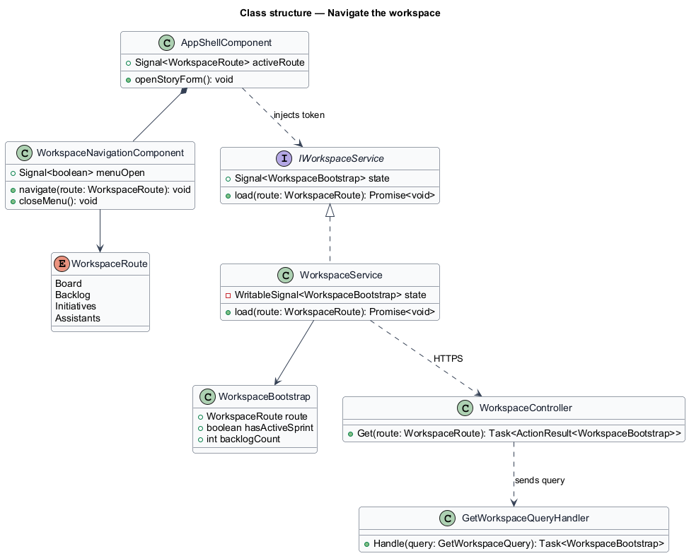
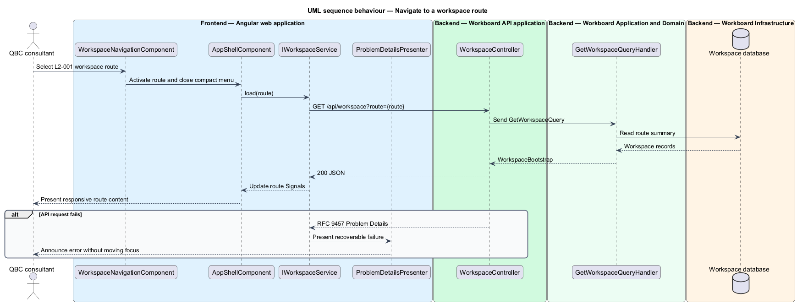

# Navigate the workspace

## Overview

QBC Workboard provides one workspace for consulting delivery. The workspace
connects four primary work areas: the active sprint board, backlog, initiative
hierarchy, and assistant directory.

*workspace route* — browser-addressable location for one primary work area

*application shell* — persistent navigation and action frame surrounding the
active workspace route

The application shell preserves orientation while route content changes. Its
layout adapts from persistent desktop navigation to a compact mobile menu. The
same actions remain available through keyboard, touch, and assistive technology.

## Description

The feature crosses the Angular application shell and the route-specific data
queries exposed by the API.

- **`AppShellComponent`** — Angular shell that renders branding, primary
  navigation, route content, and the global New story action.
- **`WorkspaceNavigationComponent`** — navigation component that identifies the
  active route and controls the compact menu.
- **`WorkspaceRoute`** — route-data type for Board, Backlog, Initiatives, and
  Assistants destinations.
- **`IWorkspaceService`** — interface consumed through `WORKSPACE_SERVICE`. It
  exposes route initialization state as Signals.
- **`WorkspaceService`** — HTTP-backed implementation that loads the minimum
  state needed by an activated route.
- **`WorkspaceController`** — ASP.NET Core controller that returns the workspace
  bootstrap projection.
- **`GetWorkspaceQueryHandler`** — MediatR handler that composes summary data
  without loading unrelated entity details.
- **`ProblemDetailsPresenter`** — frontend adapter that turns API failures into
  accessible, actionable feedback.

The responsive shell uses CSS layout breakpoints rather than JavaScript viewport
branches. Modal components restore focus to their invoking control after close.
The route content uses semantic headings, landmarks, and live regions.

## Requirements

The feature realizes the following level-2 (L2) requirements. Each L2
requirement refines one level-1 (L1) requirement.

| L2 ID | Refines (L1) | Requirement |
|-------|--------------|-------------|
| `L2-001` | `L1-001` | The application shall expose routes for the active board, backlog, initiative hierarchy, and assistant directory and shall provide persistent navigation among them. |
| `L2-024` | `L1-009` | All supported features shall remain usable without horizontal page scrolling at viewport widths from 320 CSS pixels upward. |
| `L2-025` | `L1-009` | The application shall target WCAG 2.2 Level AA for the delivered workflows. |
| `L2-026` | `L1-009` | The product shall preserve the mock's restrained visual language, generous whitespace, clear typography, progressive disclosure, and explicit feedback. |

## Diagrams

### System context

The consultant enters QBC Workboard through a browser. The product presents all
workspace areas within one navigable system boundary.

### Containers

The Angular application owns routing and presentation. It requests route data
from the ASP.NET Core API, which reads persisted workspace state.

### Components

The application shell activates a route and calls the interface-backed workspace
service. The API controller dispatches the corresponding bootstrap query.

### Class structure

The shell composes navigation and route content. The service contract separates
the component from the HTTP implementation.

### Behaviour — navigate to a workspace route

Route activation updates the shell immediately and loads the route projection.
The error branch preserves navigation and presents recoverable feedback.

